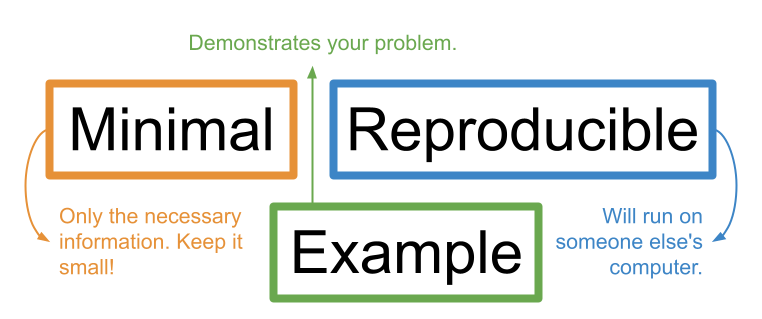
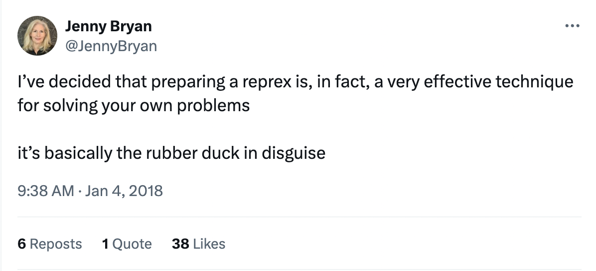
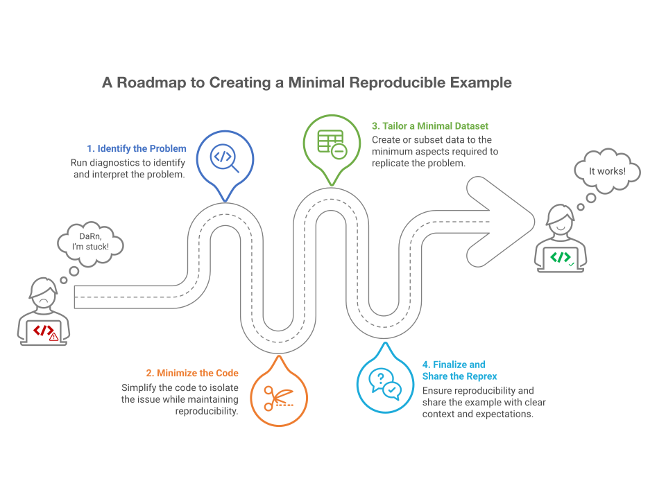

## Welcome and introductions

Welcome to "RRRR, I’m Stuck!" We’re glad you’re here. Let’s first take care of a few setup steps. You should all have followed the setup instructions on the workshop website, and you should have both R and RStudio installed. You should also have the following packages installed: {reprex}, {tidyverse}, and {ggplot2}. If you haven't installed those packages, please take a moment to install them now. 

We have a range of levels of experience here. This workshop assumes that you are a researcher in ecology or biology who has some prior experience working with R in RStudio. 

This lesson will follow a fictional ecology grad student named Mickey as they explore a new dataset, deal with various common coding problems, and learn how to write a minimal reproducible example to ask for help in community forums. We will not spend much time discussing the code itself, as we will assume you have a basic background.

It’s okay if you’re not an R expert. But even experienced coders may not always know how to get unstuck, so we hope this workshop will be useful to many levels of coding background.

At the end of this lesson, we are hoping that you will have achieved two main things:

**First**, you will understand the importance of minimal reproducible examples for getting unstuck. **Second**, you will be equipped with a "road map" for breaking down your problem and constructing a minimal reproducible example. This road map can be applied broadly to various problems that you might encounter with your code in the future. The road map won't necessarily solve every problem you may encounter, but it will serve as a toolkit for seeking help and getting unstuck in the future.

In this **first episode**, we will introduce the concept of a *minimal reproducible example* and how it can be useful for getting unstuck while coding. We will introduce the road map that highlights the key steps we will follow as we move through the lesson. Finally, we will take a look at the dataset that we'll be using throughout the rest of the lesson.

::: questions
-   What steps can you take to solve problems in your code?
-   What is a minimal reproducible example?
-   Why are minimal reproducible examples important?
-   What is the Portal Project dataset?
:::

::: objectives
-   Describe a minimal reproducible example and its requirements.
-   Recognize how creating a minimal reproducible example can help you solve problems in your code.
-   Explain the benefits of creating a minimal reproducible example both for you and for others.
-   Load in the rodent survey data and briefly explain its contents.
:::

::: instructor
The following exercises are optional, but they can are useful for getting learners settled in. They could happen at the start of the lesson, to break the ice:

"Before we begin, let's take a moment to reflect on why we are here,"

...or they can happen after a first introduction to reprexes.
:::

Let's start out with a quick brainstorm.

::: challenge
### Exercise 1 (think, pair, share): When you get stuck

When you're coding in R and you get stuck, what are some things that you do to get help or get unstuck?
:::

One of the most frustrating parts of learning to code is getting stuck and not knowing what to do! Maybe R gives you an angry red error message you don’t understand, or your code doesn’t seem to be doing what you were expecting and you don’t know why. Maybe you try to use Google to find answers but you can’t quite find the same problem out there. What to do?

Luckily, there are many people in the R and data science communities who are happy to help. However, in order for them to do so, you must give them the right information. Figuring out how to ask a good question can be hard. 

::: challenge
### Exercise 2 (think, pair, share): Helping someone else

Think about a time that you helped someone else with their code. What information did you need to know in order to help? (Alternatively: think about a time that someone helped you. What did they need to know in order to help?)
:::

Many helpers or forums may ask you to provide example data or a **minimal reproducible example** (commonly abbreviated as a "**reprex**"). What even is that? Wouldn’t it be nice if you could just hand over your computer so someone helping with your code can see exactly what is happening? That's exactly what the reprex is for.

## What is a minimal reproducible example ("reprex")?

A reprex is essentially a **simplified** version of your problematic code that clearly demonstrates the problem you are facing (includes **only** the necessary information to show the problem, nothing more) and **will run easily on anyone's computer**.

The Tidyverse documentation puts it simply:

> “The goal of a reprex is to package your problematic code in such a way that other people can run it and feel your pain. Then, hopefully, they can provide a solution and put you out of your misery.” - [Get help! (Tidyverse)](https://www.tidyverse.org/help/)



::: instructor
If you didn't take time for the reflection exercises at the beginning, you could also pause to do them here.
:::

## Why use a reprex?

Reprexes are very important tools to get help when you're stuck on a coding problem. You may be asked to provide a reprex when you're working with a statistical consultant (often available at universities) or when posting a question to online help forums (such as StackOverflow or the Posit Community).

As the name suggests, a minimal reproducible example needs to be **minimal** and **reproducible**.

-   Stripping the code and data down to their essential (**minimal**) parts makes it easy for a helper to zero-in on what might be going wrong.

-   Making your example **reproducible** allows a helper to run your code on their own computer so they can easily "tinker" with it to fix it. This makes them more likely to help you.

::: callout
### Helpers

There are lots of people who might help you with your code: friends, colleagues, mentors, or total strangers online. In this lesson, we will use the term "helper" to refer to the person who is helping you to debug your code. Helpers are the target audience for your minimal reproducible example.
:::

But there's another hidden reason to make a reprex! The process of making a reprex often leads to a better understanding of your own code. Therefore, you might end up solving the problem yourself without asking for help.

::: callout
### Rubber duck debugging

The phenomenon of solving one’s own problem during the process of trying to explain it to someone else is often called "rubber duck debugging." This is a reference to a story about programmers who would explain the problem they were having with their code to a rubber duck they would keep on their desk. Jenny Bryan refers to reprexes as "basically the rubber duck in disguise," because they force you to unpack your problem to explain it more clearly.

Jenny Bryan shares many other insights about reprexes in her 2018 talk ["Help me help you: Creating reproducible examples."](https://www.youtube.com/watch?v=5gqksthQ0cM)
:::



Making a reprex can be an excellent learning opportunity, but the process can feel daunting when you are not sure where to begin. In this lesson, we will walk through a **step by step roadmap** you can use whenever you feel stuck, including some first steps for debugging your code and the process of creating a reprex. We’ll talk about each of the steps and provide a workflow that you can follow when you get stuck in the future. At the end, we’ll introduce you to the [{reprex}](https://reprex.tidyverse.org/) package, a useful tool for creating good minimal reproducible examples. By the end of the lesson you will have gained a better understanding of how to approach error and warning messages, you will feel more confident in your ability to make a reprex, and you will feel more comfortable asking for formal help.

## Meet Mickey, your learning companion

Mickey is an ecology grad student who just joined a new lab. Mickey's lab has been working for many years with data from the [Portal Project](https://portal.weecology.org/), a long-term research study of rodents in Portal, Arizona. Mickey would like to explore this data for their research, so they reach out to Remy, a fifth-year grad student who is very familiar with this project. To get Mickey started, Remy sends Mickey an archival dataset of rodent surveys from 1977-1989, and tells Mickey to "play around" with the data in RStudio to get familiar with it.

Mickey has some past experience in R. They attended the "[Data Analysis and Visualization in R for Ecologists](https://datacarpentry.github.io/R-ecology-lesson/)" Carpentries workshop, and they feel comfortable with the fundamentals of coding in R. Still, Mickey is a little rusty and nervous about their skills and the unfamiliar data.

::: callout
### Prerequisites and target audience

This workshop assumes some prior experience with working in R and RStudio. We will assume you've taken the equivalent of the Data Analysis and Visualization in R for Ecologists workshop and are comfortable with basic commands, and we won't necessarily explain every line of code in detail.

If you're much more experienced in R, this workshop is still for you! Even expert coders may not always know how to get unstuck. We hope this workshop will be useful to people with a variety of coding backgrounds.

Also: in this lesson, we will be working in R. However, the principles and concepts of the road map should be applicable to other programming languages, too!
:::

So, we've been talking about the theory behind reprexes and introducing you to the workshop. From now on, we're going to shift over to live coding. At this point, you should go ahead and open RStudio. Make sure that you're in the RStudio project that you created for this lesson, and that you've downloaded the data as a csv and saved it in the "data/" folder. Let's take a few moments to get set up here.

::: callout
As a reminder: Make sure you're coding in your RStudio project. You can open the project you created by double-clicking the ".Rproj" file from your Finder/File Explorer. Or, from inside of RStudio, navigate to the upper right corner of the screen, click on the blue cube icon, choose "Open Project", and then select your project to open a new session of RStudio.
:::

::: instructor
This would be a great time to do a sticky note or reaction check to make sure that everyone is ready to go before proceeding.
:::

Okay, so let's follow along with Mickey as they begin to explore the data. Mickey opens RStudio and starts by loading the {tidyverse}, a set of packages that will be useful for wrangling and visualizing the data.

::: instructor
Loading the entire {tidyverse} here, rather than a few component packages, is an intentional over-complication so that we can teach learners to simplify their packages later. Learners should have {tidyverse} installed, as per the setup instructions. They should also already have a project and folders set up, with the data downloaded and in the "data" folder of the project.

If necessary, here is the url for the data: <https://raw.githubusercontent.com/carpentries-incubator/R-help-reprexes/refs/heads/main/episodes/data/surveys_complete_77_89.csv>
:::


``` r
# Loading the tidyverse package
library(tidyverse)
```


Next, we can use the read_csv function from one of those tidyverse packages to load in the dataset. This line of code assumes that you have stored the surveys dataset in the data/ folder, according to the setup instructions.


``` r
# Uploading the dataset that is currently saved in the project's data folder
surveys <- read_csv("data/surveys_complete_77_89.csv") 
```

``` output
Rows: 16878 Columns: 13
── Column specification ────────────────────────────────────────────────────────
Delimiter: ","
chr (6): species_id, sex, genus, species, taxa, plot_type
dbl (7): record_id, month, day, year, plot_id, hindfoot_length, weight

ℹ Use `spec()` to retrieve the full column specification for this data.
ℹ Specify the column types or set `show_col_types = FALSE` to quiet this message.
```

Let's follow along with Mickey as they examine the dataset. Mickey wants to get familiar with the dataset and find out what type of data was collected during these surveys.


``` r
# Take a look at the data
glimpse(surveys)

# or you can use
str(surveys)
```

``` output
Rows: 16,878
Columns: 13
$ record_id       <dbl> 1, 2, 3, 4, 5, 6, 7, 8, 9, 10, 11, 12, 13, 14, 15, 16,…
$ month           <dbl> 7, 7, 7, 7, 7, 7, 7, 7, 7, 7, 7, 7, 7, 7, 7, 7, 7, 7, …
$ day             <dbl> 16, 16, 16, 16, 16, 16, 16, 16, 16, 16, 16, 16, 16, 16…
$ year            <dbl> 1977, 1977, 1977, 1977, 1977, 1977, 1977, 1977, 1977, …
$ plot_id         <dbl> 2, 3, 2, 7, 3, 1, 2, 1, 1, 6, 5, 7, 3, 8, 6, 4, 3, 2, …
$ species_id      <chr> "NL", "NL", "DM", "DM", "DM", "PF", "PE", "DM", "DM", …
$ sex             <chr> "M", "M", "F", "M", "M", "M", "F", "M", "F", "F", "F",…
$ hindfoot_length <dbl> 32, 33, 37, 36, 35, 14, NA, 37, 34, 20, 53, 38, 35, NA…
$ weight          <dbl> NA, NA, NA, NA, NA, NA, NA, NA, NA, NA, NA, NA, NA, NA…
$ genus           <chr> "Neotoma", "Neotoma", "Dipodomys", "Dipodomys", "Dipod…
$ species         <chr> "albigula", "albigula", "merriami", "merriami", "merri…
$ taxa            <chr> "Rodent", "Rodent", "Rodent", "Rodent", "Rodent", "Rod…
$ plot_type       <chr> "Control", "Long-term Krat Exclosure", "Control", "Rod…
spc_tbl_ [16,878 × 13] (S3: spec_tbl_df/tbl_df/tbl/data.frame)
 $ record_id      : num [1:16878] 1 2 3 4 5 6 7 8 9 10 ...
 $ month          : num [1:16878] 7 7 7 7 7 7 7 7 7 7 ...
 $ day            : num [1:16878] 16 16 16 16 16 16 16 16 16 16 ...
 $ year           : num [1:16878] 1977 1977 1977 1977 1977 ...
 $ plot_id        : num [1:16878] 2 3 2 7 3 1 2 1 1 6 ...
 $ species_id     : chr [1:16878] "NL" "NL" "DM" "DM" ...
 $ sex            : chr [1:16878] "M" "M" "F" "M" ...
 $ hindfoot_length: num [1:16878] 32 33 37 36 35 14 NA 37 34 20 ...
 $ weight         : num [1:16878] NA NA NA NA NA NA NA NA NA NA ...
 $ genus          : chr [1:16878] "Neotoma" "Neotoma" "Dipodomys" "Dipodomys" ...
 $ species        : chr [1:16878] "albigula" "albigula" "merriami" "merriami" ...
 $ taxa           : chr [1:16878] "Rodent" "Rodent" "Rodent" "Rodent" ...
 $ plot_type      : chr [1:16878] "Control" "Long-term Krat Exclosure" "Control" "Rodent Exclosure" ...
 - attr(*, "spec")=
  .. cols(
  ..   record_id = col_double(),
  ..   month = col_double(),
  ..   day = col_double(),
  ..   year = col_double(),
  ..   plot_id = col_double(),
  ..   species_id = col_character(),
  ..   sex = col_character(),
  ..   hindfoot_length = col_double(),
  ..   weight = col_double(),
  ..   genus = col_character(),
  ..   species = col_character(),
  ..   taxa = col_character(),
  ..   plot_type = col_character()
  .. )
 - attr(*, "problems")=<pointer: 0x562c15cd1550> 
```

Looking over Mickey's shoulder, Remy explains that the dataset is made up of many individual rodent records (`record_id`). The date of each record is given by the `month`, `day`, and `year` columns.

The dataset includes data from a number of different study plots that had different treatments applied: plot IDs are given by the `plot_id` column, and the type of treatment is specified in `plot_type`.

There is information about the `genus` and `species` of each individual caught. There is a `species_id` column that identifies the species of each individual caught.

In addition, there is a column called `taxa` that contains higher-level taxonomic information. Most of the observations are rodents, but there are also some birds, rabbits, and reptiles.

For each individual caught, the field crew took `weight`, `sex` and `hindfoot_length` measurements *when possible*, so values are sometimes missing.

Overall, the dataset contains 16,878 rodent observations ranging across years from 1977 through 1989.

With a clear understanding of the data, Mickey is now free to explore on their own. However, Remy notices that Mickey still looks nervous, hesitating to write any code for fear of messing things up. Remy decides to share a tool they recently found useful: a roadmap to getting unstuck in R by making a reprex. Let's take a quick break from our own RStudio sessions and look through this road map together before we get back to coding.



Remy's roadmap outlines four key steps for making a reprex. It is also intended to help the user better understand their problem and potentially find a solution along the way. Remy explains that they follow these steps any time they get stuck while coding. Indeed, the first portion of the roadmap, which Remy likes to call "Code First Aid," includes preliminary steps to help identify and diagnose the problem, such as determining the type of error, reading function documentation, interpreting error messages, and running through the code line by line.

Remy explains that sometimes, these "First Aid" steps will be enough to solve code problems. But if not, the rest of the roadmap will lead Mickey through strategies to better understand the problem and demonstrate it to others in a minimal reproducible example ("reprex").

Remy emphasizes to Mickey that they are happy to keep helping, but they will be very busy trying to finish writing their dissertation. If Mickey can first follow the steps outlined in this roadmap, then Remy can more easily help with whatever Mickey is struggling to resolve.

Mickey takes a deep breath. With an introduction to the dataset and a roadmap for guidance if they get stuck, Mickey feels ready to start coding! They decide to start by learning more about which taxa are included in the dataset, since their analysis will focus only on rodents. Mickey wants to create a frequency table of the `taxa` column.


``` r
table(taxa)
```

``` error
Error:
! object 'taxa' not found
```

Immediately, Mickey encounters an error! What's going on? Already, Mickey has an opportunity to try out Remy's roadmap. 

In the next episode, we will begin to explore the roadmap, starting with some "code first aid" strategies. We'll learn more about different types of errors and how to start fixing them, and hopefully we'll be able to help Mickey get unstuck.

::: instructor
Mickey feels ready to start coding and using the roadmap. Do your learners also feel ready? This could be a good place to ask what questions they have :)
:::

::: keypoints
-   Throughout this lesson, we will be walking through a "roadmap" to getting unstuck in R by creating a minimal reproducible example ("reprex").
-   A reprex is a simplified version of your problematic code that clearly demonstrates the problem you are facing and will run on anyone's computer.
-   A reprex should contain only the minimum required to replicate the problem from any device so that helpers can more easily tinker and debug your code.
-   The process of building a reprex helps you better understand your code, your data, and your problem so that you will often find the solution yourself!
-   The `surveys` dataset includes records of rodents captured in a variety of experimental plots over a 12-year period, including some data about each rodent's sex and morphology.
:::
