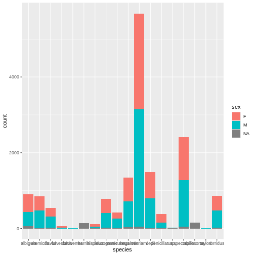

::: questions
-   What do I do when I encounter an error?
-   What do I do when my code outputs something I don’t expect?
-   Why do errors and warnings appear in R?
-   How can I find which areas of code are responsible for errors?
-   How can I fix my code? What other options exist if I can't fix it?
:::

::: objectives
After completing this episode, participants should be able to...

-   Describe how the desired code output differs from the actual output
-   Categorize an error message (e.g. syntax error, semantic errors, package-specific errors, etc.)
-   Describe what an error message is trying to communicate
-   Identify specific lines and/or functions generating the error message
-   Use R Documentation to look up function syntax and examples
-   Quickly fix commonly-encountered R errors using 'code first aid' 
-   Identify when a problem is better suited for asking for further help, including making a `reprex`
:::


The first step we'll cover is what to do when encountering an error or other undesired output from your code. With this episode, we hope to teach you the basics about identifying errors, rectifying them if possible, and if not, how to isolate the problem for others to look at. This is the first step in our "roadmap" of how to solve coding problems -- recognizing when something you don't intend is happening with your code, and then identifying the problem (to a lesser or greater degree) in order to solve it yourself or be able to succinctly describe it to a helper.

Then, we'll return to Mickey's analysis at the end of the lesson.

## 3.1 What do I do when I encounter an error message?

While sometimes frustrating to read, R will often let us know when a problem occurs by generating an error message that tells us exactly why R was unable to run our code. This type of ‘error’ is often referred to as a **syntax** error. When R is unable to run your code, it will return this type of error message, and stop the program (as opposed to a **warning** or attempting to run further lines despite the error). Error messages may happen for many reasons. However, deciphering the meaning of such error messages is not always as easy as we might hope. While we can't review every type of reason your code generates an error, we will try to teach you some tools for you to interpret and figure out syntax errors for yourself.


``` r
# Make some plots
ggplot(x = taxa) + geom_bar()
```

``` error
Error: object 'taxa' not found
```

Though we know somewhere there is an object called `taxa` (it is actually a column of the dataset `surveys`), R is trying to communicate that it cannot find any such object in the local environment. Let's try again, appropriately pointing ggplot to the `surveys` dataset and `taxa` column using the `$` operator. However, an error R *didn't* tell us was happening is that we forgot to add `aes`, pointing `ggplot` to the fact that we're directly defining the aesthetic (e.g. what goes on the x axis) from data. Let's add that fix now. 


``` r
ggplot(aes(x = surveys$taxa)) + geom_bar()
```

``` error
Error in `fortify()`:
! `data` must be a <data.frame>, or an object coercible by `fortify()`,
  or a valid <data.frame>-like object coercible by `as.data.frame()`, not a
  <uneval> object.
ℹ Did you accidentally pass `aes()` to the `data` argument?
```

Whoops! Here we see another error message -- this time, R responds with a perhaps more uninterpretable message.

Let's go over each part briefly. First, we see an error from a function called `fortify`, which we didn't even call! Then, there's a more helpful informational message: Did we accidentally pass `aes()` to the `data` argument? This does seem to relate to our line of code, as we do pass `aes` into the `ggplot` function. But what is this "`data` argument?" A helpful starting place when attempting to decipher an error message is checking the documentation for the function which caused the error:

`?ggplot`

Here, a Help window pops up in RStudio which provides some more information. Skipping the general description at the top, we see ggplot takes positional arguments of `data`, *then* `mapping`, which uses the `aes` call. We can see in "Arguments" that the `aes(x = surveys$taxa)` object we passed in is attempted by `fortify` to be converted to a data.frame: now the picture is clear! We accidentally passed our `mapping` argument (telling ggplot how to map variables to the plot) into the position it expected `data` in the form of a data frame. And if we scroll down to "Examples", to "Pattern 1", we can see exactly how ggplot expects these arguments in practice. Let's amend our result:


``` r
ggplot(surveys, aes(x = taxa)) + geom_bar()
```


Here we see our desired plot. Lots of Rodents!

## Stop no. 1 on our roadmap: Identifying the problem

Let's pause here to highlight some patterns we're starting to see in the course of fixing our code:

1.  Seeing a problem arise in our code (in this case, R is explicitly telling us it has a problem running it).

2.  Reading and interpreting the error message R gives us.

Other steps we might take then include:

3.  Acting on parts of the error we can understand, such as changing input to a function.

4.  Pulling up the R Documentation for that function, and reading the documentation's Description, Usage, Arguments, Details and Examples entries for greater insight into our error.

5.  Copying and pasting the error message into a search engine / generative LLM for more interpretable explanations.

And, when all else fails, we can prepare our code into a reproducible example for expert help.

While the above steps may be new or seem familiar, we abstract this a little bit to explicitly address something: recognizing when a problem arises and attempting to interpret *what* is going wrong is essential to fixing it. This is true whether you fix the problem on your own, or communicate it to an expert. The latter steps we listed might be categorized as attempts to immediately address the problem -- we'll call these **code first aid** -- these steps might fix the problem, give you greater insight into what the problem is (and how R is interpreting your code), or not be helpful at all. 

In any case, we want to emphasize that these skill sets are essential to being a practiced coder able to effectively seek help. While the errors we've encountered so far may seem too trivial to warrant pull up a whole checklist, below we will see examples of problems that are trickier to both recognize and interpret. But in those cases, we'll nonetheless apply the same framework.

:::::::::: challenge

Below we see an error message pop up when trying to quantify the counts of `genus` and `species` in our dataset. Which of the following interpretations of the error message most aptly describes the problem (hint: look at the `?tally` documentation if you're stuck!)


``` r
surveys %>% tally(genus, species)
```

``` error
Error in `tally()`:
ℹ In argument: `n = sum(genus, na.rm = TRUE)`.
Caused by error in `sum()`:
! invalid 'type' (character) of argument
```


a. `tally` does not accept `'type' (character)` arguments. We should change genus and species to factors or numbers and run this line again.

b. `tally` does not accept `'type' (character)` arguments. There is no way to quantify these data with this function.

c. `tally` does not accept `'type' (character)` arguments. We need to assign a weight (e.g. 1) to each row so it knows how much to numerically weigh each observation.

d. `tally` does not accept `'type' (character)` arguments. This function is not intended to `group_by` two variables and a different function (`count`) is required instead. 

::: solution
d is the correct answer!


``` r
surveys %>% count(genus, species)
```

``` output
# A tibble: 36 × 3
   genus            species             n
   <chr>            <chr>           <int>
 1 Ammospermophilus harrisi           136
 2 Amphispiza       bilineata         223
 3 Baiomys          taylori             3
 4 Calamospiza      melanocorys        13
 5 Callipepla       squamata           16
 6 Campylorhynchus  brunneicapillus    23
 7 Chaetodipus      penicillatus      382
 8 Crotalus         scutalatus          1
 9 Crotalus         viridis             1
10 Dipodomys        merriami         5675
# ℹ 26 more rows
```
:::
::::

## 3.2 What do I do when my code outputs something I don't expect

Another type of problem you may encounter is when your R code runs without errors, but does not produce the desired output. You may sometimes see these called **semantic errors**. As with syntax errors, semantic errors may occur for a variety of non-intuitive reasons, and are often harder to solve as there is no description of the error -- you must work out where your code is defective yourself!

Let's go back to our rodent analysis. The next step in the plan is to subset to just the `Rodent` taxa (as opposed to other taxa: Bird, Rabbit, Reptile or NA). Let's quickly check to see how much data we'd be throwing out by doing so:


``` r
table(surveys$taxa)
```

``` output

   Bird  Rabbit Reptile  Rodent 
    300      69       4   16148 
```

We're interested in the rodents, and thankfully it seems like a majority of our observations will be maintained when subsetting to rodents. But wait... In our plot above, we can clearly see the presence of NA values. Why are we not seeing them here? Our command was correctly executed, but the output is not everything we intended. Having no error message to interpret, let's jump straight to the function documentation:


``` r
?table
```

``` output
Help on topic 'table' was found in the following packages:

  Package               Library
  vctrs                 /home/runner/.local/share/renv/cache/v5/linux-ubuntu-jammy/R-4.5/x86_64-pc-linux-gnu/vctrs/0.6.5/c03fa420630029418f7e6da3667aac4a
  base                  /home/runner/.cache/R/renv/sandbox/linux-ubuntu-jammy/R-4.5/x86_64-pc-linux-gnu/9a444a72


Using the first match ...
```

Here, the documentation provides some clues: there seems to be an argument called `useNA` that accepts "no", "ifany", and "always", but it's not immediately apparent which one we should use to show our NA values. Let's set that aside and try something else. As a second approach, let's go to `Examples` to see if we can find any quick fixes. Here we see a couple lines further down:

``` r
table(a)                 # does not report NA's
table(a, exclude = NULL) # reports NA's
```

That seems like it should be inclusive. Let's try again:


``` r
table(surveys$taxa, exclude = NULL)
```

``` output

   Bird  Rabbit Reptile  Rodent    <NA> 
    300      69       4   16148     357 
```

Now our NA values show up in the table. We see that by subsetting to the "Rodent" taxa, we would losing about 357 NAs, which themselves could be rodents! However, in this case, it seems a small enough portion to safely omit. Let's subset our data to the rodent taxon.


``` r
# Just rodents
rodents <- surveys %>% filter(taxa == "Rodent")
```

:::: challenge
There are 3 lines of code below, and each attempts to create the same plot. Identify which produces a syntax error, which produces a semantic error, and which correctly creates the plot (hint: this may require you inferring what type of graph we're trying to create!)

A.  `ggplot(rodents) + geom_bin_2d(aes(month, plot_type))`

B.  `ggplot(rodents) + geom_tile(aes(month, plot_type), stat = "count")`

C.  `ggplot(rodents) + geom_tile(aes(month, plot_type))`

::: solution
In this case, A correctly creates the graph, plotting as colors in the tile the number of times an observation is seen. It essentially runs the following lines of code:


``` r
rodents_summary <- rodents %>% group_by(plot_type, month) %>% summarize(count=n())
```

``` output
`summarise()` has grouped output by 'plot_type'. You can override using the
`.groups` argument.
```

``` r
ggplot(rodents_summary) + geom_tile(aes(month, plot_type, fill=count))
```


B is a syntax error, and will produce the following error:


``` r
ggplot(rodents) + geom_tile(aes(month, plot_type), stat = "count")
```

``` error
Error in `geom_tile()`:
! Problem while computing stat.
ℹ Error occurred in the 1st layer.
Caused by error in `setup_params()`:
! `stat_count()` must only have an x or y aesthetic.
```
Finally, C is a semantic error. It does produce a plot, which is rather meaningless:


``` r
ggplot(rodents) + geom_tile(aes(month, plot_type))
```


:::
::::

## Summary

In general, encountering semantic errors can make our job more difficult, but the roadmap remains the same:

1.  Seeing a problem arise in our code.

2.  Interpreting the problem.

Let's fill in more steps to our **code first aid** :

1.  Acting on parts of the error we can understand

-   changing input to a function
-   checking on the control flow of code (e.g. for loops, if/else)

2.  Pulling up the R Documentation for relevant functions

-   reading the documentation's **Description**, **Usage**, **Arguments**, **Details**
-   testing out **Examples** entries in the console for greater insight

3.  Quick online help with a search engine / generative LLM

-   Copying error messages for more interpretable explanations
-   Describing your error in the hopes of an already-solved solution
-   Seeing if an LLM generates equivalent error-free code solving the same goal

And, when all else fails, we can prepare our code into a reproducible example for expert help.

The steps to identifying the problem and in **code first aid** matches what we've seen above. However, here seeing the problem arise in our code may be much more subtle, and comes from us recognizing output we don't expect or know to be wrong. Even if the code is run, R may give us **warning** or informational messages which pop up when executing your code. Most of the time, however, it's up to the coder to be vigilant and be sure steps are running as they should. Interpreting the problem may also be more difficult as R gives us little or no indication about how it's misinterpreting our intent. 


::: callout
Generally, the more your code deviates from just using base R functions, or the more you use specific packages, both the quality of documentation and online help available from search engines and Googling gets worse and worse. While base R errors will often be solvable in a couple of minutes from a quick `?help` check or a long online discussion and solutions on a website like Stack Overflow, errors arising from little-used packages applied in bespoke analyses might merit isolating your specific problem to a reproducible example for online help, or even getting in touch with the developers! Such community input and questions are often the way packages and documentation improves over time.
:::

## 3.3 How can I find where my code is failing?

Isolating your problem may not be as simple as assessing the output from a single function call on the line of code which produces your error. Often, it may be difficult to determine which lines or logical sections of code (e.g. functions) are producing the error.

Consider the example below, where we now are attempting to see which species of kangaroo rodents appear in different plot types over the years. To do so, we'll filter our dataset to just include the genus *Dipodomys*, the kangaroo rats. Then we'll plot a histogram of which how many observations are seen in each plot type over an x axis of years.


``` r
# Just k-rats
krats <- rodents %>% filter(genus == "Dipadomys") #kangaroo rat genus

ggplot(krats, aes(year, fill=plot_type)) + 
geom_histogram() +
facet_wrap(~species)
```

``` error
Error in `combine_vars()`:
! Faceting variables must have at least one value.
```

Uh-oh. Another error here, when we try to make a ggplot. But what is "combine_vars?" And then: "Faceting variables must have at least one value" What does that mean?

This is not an easily-interpretable error message from ggplot, and our code looks like it *should* run. Perhaps we can take a step back and see whether our error is actually not in the ggplot code itself. Often, when trying to isolate the problem area, it is a good idea to look back at the original input. So let’s take a look at our `krats` dataset.


``` r
krats
```

``` output
# A tibble: 0 × 13
# ℹ 13 variables: record_id <dbl>, month <dbl>, day <dbl>, year <dbl>,
#   plot_id <dbl>, species_id <chr>, sex <chr>, hindfoot_length <dbl>,
#   weight <dbl>, genus <chr>, species <chr>, taxa <chr>, plot_type <chr>
```

It's empty! What went wrong with our "Dipadomys" filter? Let's use a print statement to see which genera are included in the original rodents dataset.


``` r
print(rodents %>% count(genus))
```

``` output
# A tibble: 12 × 2
   genus                n
   <chr>            <int>
 1 Ammospermophilus   136
 2 Baiomys              3
 3 Chaetodipus        382
 4 Dipodomys         9573
 5 Neotoma            904
 6 Onychomys         1656
 7 Perognathus        553
 8 Peromyscus        1271
 9 Reithrodontomys   1412
10 Rodent               4
11 Sigmodon           103
12 Spermophilus       151
```

We see two things here. For one, we've misspelled *Dipodomys*, which we can now amend. This quick function call also tells us we should expect a data frame with 9573 values resulting after subsetting to the genus *Dipodomys*.


``` r
krats <- rodents %>% filter(genus == "Dipodomys") #kangaroo rat genus
dim(krats)
```

``` output
[1] 9573   13
```

``` r
ggplot(krats, aes(year, fill=plot_type)) + 
geom_histogram() +
facet_wrap(~species)
```

``` output
`stat_bin()` using `bins = 30`. Pick better value with `binwidth`.
```


Our improved code here looks good. Checking the dimensions of our subsetted data frame using the dim() function confirms we now have all the *Dipodomys* observations, and our plot is looking better. In general, having a 'print' statement or some other output after we manipulate data or other major steps can be a good way to check your code is producing intermediate results consistent with your expectations.

::: callout
Often, giving your expert helpers access to the entire problem, with a detailed description of your desired output, allows you to directly improve your coding skills and learn about new functions and techniques.
:::

## Summary

With the length of a full script of code, it may be difficult to find exactly where our code is falling short, even if we can identify the proximal problem that arises (e.g. a plot not showing up).

Our roadmap to identifying problems in our code may now look like:

1.  Seeing a problem arise in our code.

2.  Isolating our code to the problem area.

3.  Interpreting the problem.

Now we can see the need to isolate the specific areas of code causing the bug or problem, even if that does not solve the problem itself. There is no general rule of thumb as to how large this needs to be. But, unless our problem occurs on the first line, and we don't understand the error until the last line, we should be able to isolate our code a bit: Any early lines which we know run correctly and as intended may not need to be included, and by isolating the problem area as much as we can to make it understandable to others. We'll go over this in more detail in the next episode.

Let's add to our code first aid:

1.  Identify the problem area

-   add print statements immediately upstream or downstream of problem areas
-   check the desired output from functions
-   see whether any intermediate output can be further isolated and examined separately

2.  Acting on parts of the error we can understand

-   changing input to a function
-   checking on the control flow of code (e.g. for loops, if/else)

3.  Pulling up the R Documentation for relevant functions

-   reading the documentation's **Description**, **Usage**, **Arguments**, **Details**
-   testing out **Examples** entries in the console for greater insight

4.  Quick online help with a search engine / generative LLM

-   Copying error messages for more interpretable explanations
-   Describing your error in the hopes of an already-solved solution
-   Seeing if an LLM generates equivalent error-free code solving the same goal

And, when all else fails, we can prepare our code into a reproducible example for expert help.

While this is similar to our previous checklists, we can now understand these steps as a continuous cycle of isolating the problem into more and more discrete chunks for a reproducible example. Any step in the above that helps us identify the specific areas or aspects of our code that are failing in particular, we can zoom in on and restart the checklist. We can stop as soon as we don't understand anymore how our code fails. At this point, we can excise that area for further help using a reprex.

:::: challenge
With our new skills in mind, try to isolate the problem area as much as you can with the following lines of code. Here, we're trying to see whether kangaroo rat observations in the `control` plot type differed significantly by plot id (hopefully not!).


``` r
control_plot_data <-  krats %>% filter(plot_type == "Control")

n_control_plots <- length(control_plot_data$plot_id)
exp_proportions <- rep(1/n_control_plots, n_control_plots)

plot_counts <- control_plot_data %>% group_by(plot_id) %>% summarize(n = n())

# Chisq test -- do count values vary significantly by plot id? 

chisq.test(plot_counts$n, p = exp_proportions)
```

``` error
Error in chisq.test(plot_counts$n, p = exp_proportions): 'x' and 'p' must have the same number of elements
```

::: solution
An isolated version of the problem area might look like:


``` r
n_control_plots <- length(control_plot_data$plot_id)
exp_proportions <- rep(1/n_control_plots, n_control_plots)

# Chisq test -- do count values vary significantly by plot id? 

chisq.test(plot_counts$n, p = exp_proportions)
```

``` error
Error in chisq.test(plot_counts$n, p = exp_proportions): 'x' and 'p' must have the same number of elements
```

If we decide to move the plot_counts line right after the first control_plot_data line, as plot_counts seems to be calculated correctly. Here, we can see there's probably something wrong with the `p` argument: exp_proportions is very long, much longer than the number of control plots! Let's solve the problem.


``` r
n_control_plots <- length(unique(control_plot_data$plot_id))
exp_proportions <- rep(1/n_control_plots, n_control_plots)

# Chisq test -- do count values vary significantly by plot id? 

chisq.test(plot_counts$n, p = exp_proportions)
```

``` output

	Chi-squared test for given probabilities

data:  plot_counts$n
X-squared = 79.977, df = 7, p-value = 1.392e-14
```

We can see that some plots have significantly more or fewer counts than others! Observations of kangaroo rats are not random -- rather, some plots seem to attract the kangaroo rats more than others.
:::
::::

## 3.3 When should I prepare my code for a reprex?

There may be some point at which our **code first aid** does not help us anymore, and we still cannot figure out the problem our code is giving us, even if we've isolated it as much as we can -- in that case, it may be time to turn to expert help, by asking a coworker, mentor, or someone online for aid.

While in a classroom setting we may be used to raising our hand, pointing at our code, and saying "I'm not sure what's wrong," in reality, people have limited time, bandwidth, or requisite knowledge to be able to help out with any problem that might arise. That's why reproducing the problem with a **reproducible example** is an essential skill to getting unstuck: it allows you to ask for expert help with a problem that's clearly identified, self-contained, and reproducible, and allows the expert to quickly see whether they've got the requisite skills to answer your question! We've already covered skills pertaining to identifying the problem and some skills making sure it's self-contained. We'll see how to apply these below as we start to create a reproducible example.

### Back to our Analysis...

Mickey is interested in understanding how kangaroo rat weights differ across species and sexes, so they create a quick visualization.


``` r
ggplot(rodents, aes(x = species, fill = sex)) +
  geom_bar()
```



Whoa, this is really overwhelming! Mickey forgot that the dataset includes data for a lot of different rodent species, not just kangaroo rats. Mickey is only interested in two kangaroo rat species: *Dipodomys ordii* (Ord's kangaroo rat) and *Dipodomys spectabilis* (Banner-tailed kangaroo rat).

Mickey also notices that there are three categories for sex: F, M, and what looks like a blank field when there is no sex information available. For the purposes of comparing weights, Mickey wants to focus only rodents of known sex.

Mickey filters the data to include only the two focal species and only rodents whose sex is F or M.


``` r
rodents_subset <- rodents %>%
  filter(species == c("ordii", "spectabilis"),
         sex == c("F", "M"))
```

Because these scientific names are long, Mickey also decides to add common names to the dataset. They start by creating a data frame with the common names, which they will then join to the `rodents_subset` dataset:


``` r
# Add common names
common_names <- data.frame(species = unique(rodents_subset$species), common_name = c("Ord's", "Banner-tailed"))
common_names
```

``` output
      species   common_name
1 spectabilis         Ord's
2       ordii Banner-tailed
```

But looking at the `common names` dataset reveals a problem! The common names are not properly matched to the scientific names. For example, the genus *Ordii* should correspond to Ord's kangaroo rat, but currently, it is matched with the Banner-tailed kangaroo rat instead.

::: challenge
1.  Is this a syntax error or a semantic error? Explain why.
2.  What "code first aid" steps might be appropriate here? Which ones are unlikely to be helpful?
:::

Mickey re-orders the names and tries the code again. This time, it works! The common names are joined to the correct scientific names. Mickey joins the common names to `rodents_subset`.


``` r
common_names <- data.frame(species = sort(unique(rodents_subset$species)), common_name = c("Ord's", "Banner-Tailed"))
rodents_subset <- left_join(rodents_subset, common_names, by = "species")
```

Now, Mickey is ready to start learning about kangaroo rat weights. They start by running a quick linear regression to predict `weight` based on `species` and `sex`.


``` r
# Explore k-rat weights
weight_model <- lm(weight ~ common_name + sex, data = rodents_subset)
summary(weight_model) 
```

``` output

Call:
lm(formula = weight ~ common_name + sex, data = rodents_subset)

Residuals:
     Min       1Q   Median       3Q      Max 
-111.201   -6.466    2.534   10.799   45.799 

Coefficients: (1 not defined because of singularities)
                 Estimate Std. Error t value Pr(>|t|)    
(Intercept)      123.2007     0.8061  152.83   <2e-16 ***
common_nameOrd's -74.7342     1.3352  -55.97   <2e-16 ***
sexM                   NA         NA      NA       NA    
---
Signif. codes:  0 '***' 0.001 '**' 0.01 '*' 0.05 '.' 0.1 ' ' 1

Residual standard error: 19.71 on 939 degrees of freedom
  (35 observations deleted due to missingness)
Multiple R-squared:  0.7694,	Adjusted R-squared:  0.7691 
F-statistic:  3133 on 1 and 939 DF,  p-value: < 2.2e-16
```

The negative coefficient for `common_nameOrd's` tells Mickey that Ord's kangaroo rats are significantly less heavy than Banner-tailed kangaroo rats.

But something is wrong with the coefficients for sex. Why are there NA values for `sexM`? Let's directly visualize weight by species and sex to see.


``` r
rodents_subset %>%
  ggplot(aes(y = weight, x = common_name, fill = sex)) +
  geom_boxplot()
```

``` warning
Warning: Removed 35 rows containing non-finite outside the scale range
(`stat_boxplot()`).
```


When Mickey visualizes the data, they see a problem in the graph, too. As the model showed, Ord's kangaroo rats are significantly smaller than Banner-tailed kangaroo rats. But something is definitely wrong! Because the boxes are colored by sex, we can see that all of the Banner-tailed kangaroo rats are male and all of the Ord's kangaroo rats are female. That can't be right! What are the chances of catching all one sex for two different species?

To verify that the problem comes from the data, not from the plot code, Mickey creates a two-way frequency table, which confirms that there are no observations of female *spectabilis* or male *ordii* in `rodents_subset`. Something definitely seems wrong. Those rows should not be missing.


``` r
# Subsetted dataset
table(rodents_subset$sex, rodents_subset$species)
```

``` output
   
    ordii spectabilis
  F   350           0
  M     0         626
```

To double check, Mickey looks at the original dataset.


``` r
# Original dataset
table(rodents$sex, rodents$species)
```

``` output
   
    albigula eremicus flavus fulvescens fulviventer harrisi hispidus
  F      474      372    222         46           3       0       68
  M      368      468    302         16           2       0       42
   
    leucogaster maniculatus megalotis merriami ordii penicillatus  sp.
  F         373         160       637     2522   690          221    4
  M         397         248       680     3108   792          155    5
   
    spectabilis spilosoma taylori torridus
  F        1135         1       0      390
  M        1232         1       3      441
```

Not only were there originally males and females present from both *ordii* and *spectabilis*, but the original numbers were way, way higher! It looks like somewhere along the way, Mickey lost a lot of observations.

While we don't have the time today, let's assume Mickey worked their way through the code first aid steps, but weren't able to solve the problem.

They decide to consult Remy's road map to figure out what to do next.

(INSERT ROAD MAP PICTURE)

Since code first aid was not enough to solve this problem, it looks like it's time to ask for help using a *reprex*.

:::::::keypoints

- The first step to getting unstuck is identifying a problem, isolating the problem area, and interpreting the problem
- Often, using "code first aid" -- acting on error messages, looking at data, inputs, etc., pulling up documentation, asking a search engine or LLM, can help us to quickly fix the error on our own.
- If code first aid doesn't work, we can ask for help and prepare a reproducible example (reprex) with a defined problem and isolated code
- We'll cover future steps to prepare a reproducible example (reprex) in future episodes.

:::::::
