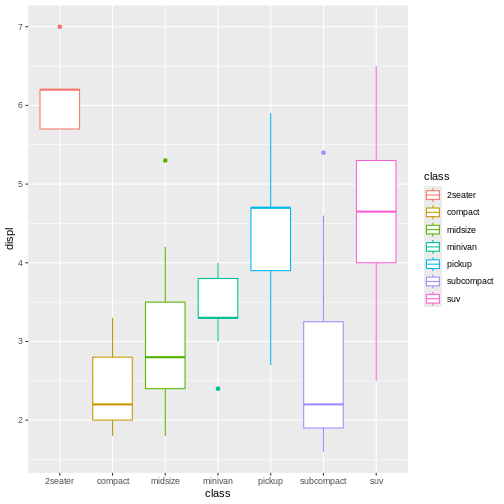
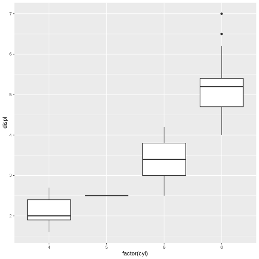
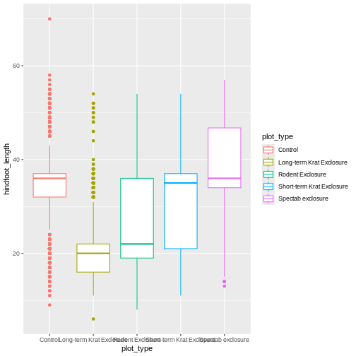

:::::::::::::::::::::::::::::::::::::::: questions

- How can I verify that my example is reproducible?
- How can I easily share a reproducible example with a mentor or helper, or online?
- How do I ask a good question?

::::::::::::::::::::::::::::::::::::::::::::::::::

::::::::::::::::::::::::::::::::::::: objectives
- Use the reprex package to test whether an example is reproducible.
- Use the reprex package to format reprexes for posting online.
- Understand the benefits and drawbacks of different help forums.
- Have a road map to follow when posting a question to make sure it's a good question.
- Understand what the {reprex} package does and doesn't do.
::::::::::::::::::::::::::::::::::::::::::::::::

Congratulations on finishing your reprex! In this episode, we will introduce a tool, the `{reprex}` package. This package will help you check that your example is truly reproducible and format it nicely to make it easy to present to a helper, either in person or online.


There are three principles to remember when you think about sharing your reprex with other people: **Reproducibility**, **formatting**, and **context**.

## 1. Reproducibility

Haven't we already talked a lot about reproducibility? 

Yes! We have discussed variables and packages, minimal datasets, and making sure that the problem is meaningfully reproduced by the data that you choose. But there are some reasons that a code snippet that appears reproducible in your own R session might not actually be runnable by someone else.

- You forgot to account for the origins of some functions and/or variables. We went through our code methodically, but what if we missed something? It would be nice to confirm that the code is as self-contained as we thought it was.

- Your code accidentally relies on objects in your R environment that won't exist for other people. For example, imagine you defined a function `my_awesome_custom_function()` in a project-specific `functions.R` script, and your code calls that function. 


``` r
my_awesome_custom_function("the kangaroo rat dataset")
```

``` error
Error in my_awesome_custom_function("the kangaroo rat dataset"): could not find function "my_awesome_custom_function"
```

I might conclude that this code is reproducible--after all, it works when I run it! But unless I remembered to include the function definition in the reprex itself, nobody will be able to run the code.

A corrected reprex would look like this:


``` r
my_awesome_custom_function <- function(x){print(paste0(x, " is awesome!"))}
my_awesome_custom_function("the kangaroo rat dataset")
```

``` output
[1] "the kangaroo rat dataset is awesome!"
```

- Your code depends on some particular characteristic of your R or RStudio environment that is not the same as your helper's environment. [more details here]

There are so many components to remember when thinking about reproducibility, especially for more complex problems. Wouldn't it be nice if we had a way to double check our examples? Luckily, the `reprex` package will help you test your reprexes in a clean, isolated environment to make sure they're actually reproducible.

The most important function in the `reprex` package is called `reprex()`. Here's how to use it.

First, install and load the `reprex` package.


``` r
#install.packages("reprex")
library(reprex)
```

Second, write some code. This is your reproducible example.


``` r
(y <- 1:4)
```

``` output
[1] 1 2 3 4
```

``` r
mean(y)
```

``` output
[1] 2.5
```

Third, highlight that code and copy it to your clipboard (e.g. `Cmd + C` on Mac, or `Ctrl + C` on Windows). 

Finally, type `reprex()` into your console.

```
# (with the target code snippet copied to your clipboard already...)
# In the console:
reprex()
```

`reprex` will grab the code that you copied to your clipboard and run that code in an _isolated environment_. It will return a nicely formatted reproducible example that includes your code and and any results, plots, warnings, or errors generated.

The generated output will be on your computer's clipboard by default. Then, you can paste it into GitHub, StackOverflow, Slack, or another venue.

::: callout
### Callout: The `reprex` package workflow

The `reprex` package workflow takes some getting used to. Instead of copying your code *into* the function, you simply copy it to the clipboard (a mysterious, invisible place to most of us) and then let the blank, empty `reprex()` function go over to the clipboard by itself and find it.

And then the completed, rendered reprex replaces the original code on the clipboard and all you need to do is paste, not copy and paste. 
:::

Let's practice this one more time. Here's some very simple code:


``` r
library(ggplot2)
library(dplyr)
mpg %>% 
  ggplot(aes(x = factor(cyl), y = displ))+
  geom_boxplot()
```



Let's highlight the code snippet, copy it to the clipboard, and then run `reprex()` in the console. 

```
# In the console:
reprex()
```

The result, which was automatically placed onto my clipboard and which I pasted here, looks like this:

``` r
library(ggplot2)
library(dplyr)
#> 
#> Attaching package: 'dplyr'
#> The following objects are masked from 'package:stats':
#> 
#>     filter, lag
#> The following objects are masked from 'package:base':
#> 
#>     intersect, setdiff, setequal, union
mpg %>% 
  ggplot(aes(x = factor(cyl), y = displ))+
  geom_boxplot()
```

<!-- -->

<sup>Created on 2024-12-29 with [reprex v2.1.1](https://reprex.tidyverse.org)</sup>

Nice and neat! It even includes the plot produced, so I don't have to take screenshots and figure out how to attach them to an email or something.

The formatting is great, but `reprex` really shines when you treat it as a helpful collaborator in your process of building a reproducible example (including all dependencies, providing minimal data, etc.)

Let's see what happens if we forget to include `library(ggplot2)` in our small reprex above.


``` r
library(dplyr)
mpg %>% 
  ggplot(aes(x = factor(cyl), y = displ))+
  geom_boxplot()
```



As before, let's copy that code to the clipboard, run `reprex()` in the console, and paste the result here.

```
# In the console:
reprex()
```

``` r
library(dplyr)
#> 
#> Attaching package: 'dplyr'
#> The following objects are masked from 'package:stats':
#> 
#>     filter, lag
#> The following objects are masked from 'package:base':
#> 
#>     intersect, setdiff, setequal, union
mpg %>% 
  ggplot(aes(x = factor(cyl), y = displ))+
  geom_boxplot()
#> Error in ggplot(., aes(x = factor(cyl), y = displ)): could not find function "ggplot"
```

<sup>Created on 2024-12-29 with [reprex v2.1.1](https://reprex.tidyverse.org)</sup>

Now we get an error message indicating that R cannot find the function `ggplot`! That's because we forgot to load the `ggplot2` package in the reprex.

This happened even though we had `ggplot2` already loaded in our own current RStudio session. `reprex` deliberately ignores any packages already loaded, running the code in a clean, isolated R session that's *different from the R session we've been working in*. This simulates the experience of someone else trying to run your reprex on their own computer. 

Let's return to our previous example with the custom function.


``` r
my_awesome_custom_function("the kangaroo rat dataset")
```

``` output
[1] "the kangaroo rat dataset is awesome!"
```

```
# In the console:
reprex()
```

``` r
my_awesome_custom_function("the kangaroo rat dataset")
#> Error in my_awesome_custom_function("the kangaroo rat dataset"): could not find function "my_awesome_custom_function"
```

<sup>Created on 2024-12-29 with [reprex v2.1.1](https://reprex.tidyverse.org)</sup>

By contrast, if we include the function definition:


``` r
my_awesome_custom_function <- function(x){print(paste0(x, " is awesome!"))}
my_awesome_custom_function("the kangaroo rat dataset")
```

``` output
[1] "the kangaroo rat dataset is awesome!"
```

```
# In the console:
reprex()
```

``` r
my_awesome_custom_function <- function(x){print(paste0(x, " is awesome!"))}
my_awesome_custom_function("the kangaroo rat dataset")
#> [1] "the kangaroo rat dataset is awesome!"
```

<sup>Created on 2024-12-29 with [reprex v2.1.1](https://reprex.tidyverse.org)</sup>

## Testing it out

Now that we've met our new reprex-making collaborator, let's use it to test out the reproducible example we created in the previous episode.

Here's the code we wrote:


``` r
# Mickey's reprex script
# XXX THIS IS NOT FINISHED--NEED TO INSERT FINAL DATA EXAMPLE!

# Load necessary packages to run the code
library(ggplot2)

rodents_subset %>% # XXX replace with simulated dataset
  ggplot(aes(y = weight, x = common_name, fill = sex)) +
  geom_boxplot() # wait, why does this look weird?

# Investigate
table(rodents_subset$sex, rodents_subset$species)
table(rodents$sex, rodents$species)
```

Time to find out if our example is actually reproducible! Let's copy it to the clipboard and run `reprex()`. Since we want to give Jordan a runnable R script, we can use `venue = "r"`.

```
# In the console:
reprex(venue = "r")
```

It worked!


``` r
#replace with final output
```

Now we have a beautifully-formatted reprex that includes runnable code and all the context needed to reproduce the problem.

:::callout
### Callout: Including information about your R session

Another nice thing about `reprex` is that you can choose to include information about your R session, in case your error has something to do with your R settings rather than the code itself. You can do that using the `session_info` argument to `reprex()`.

For example, try running the following reprex, setting session_info = TRUE, and observe what happens.


``` r
library(ggplot2)
library(dplyr)
mpg %>%
  ggplot(aes(x = factor(cyl), y = displ))+
  geom_boxplot()
```


```
# In the console:
reprex(session_info = TRUE)
```
:::

### Formatting

The output of `reprex()` is markdown, which can easily be copied and pasted into many sites/apps. However, different places have slightly different formatting conventions for markdown. `{reprex}` lets you customize the output of your reprex according to where you're planning to post it.

The default, `venue = "gh"`, gives you "[GitHub-Flavored Markdown](https://github.github.com/gfm/)", which is a particular type of markdown that works well when posted on GitHub. Another format you might want is "r", which gives you a runnable R script, with commented output interleaved with pieces of code.

Check out the formatting options in the help file with `?reprex`, and try out a few depending on the destination of your reprex!

:::callout
### Callout: `reprex` can't do everything for you

People often mention `reprex` as a useful tool for creating reproducible examples, but it can't do the work of crafting the example for you! The package doesn't locate the problem, pare down the code, create a minimal dataset, or automatically include package dependencies.

A better way to think of `reprex` is as a tool to check your work as you go through the process of creating a reproducible example, and to help you polish up the result.
:::

### Context

The final thing to consider when preparing your reproducible example is adding some context so that helpers know a little about your problem and what you're trying to achieve. 

Some context to include:
1. Tell us *a little bit* about your problem. One sentence should be enough. What domain are you working in? What are these data about? What do the relevant variables mean?

This is particularly important if you have provided a subset of your own data instead of creating a minimal dataset from scratch. Your helper will need to interpret the column names and understand what type of data they are looking at.

2. Explain *what you expected to happen*, or what you were trying to achieve, and how it is different from *what happened instead*.

The contrast between what happened and what was supposed to happen is particularly important for semantic errors, in which the "error" is not always obvious when running the code. The code ran--but you have decided that the output is "wrong" somehow, or that it "didn't work". Why? How do you know that? Your helper needs to know that what you got was not what you expected, and they need to know what you expected in order to help you achieve that outcome.


For example, let's say you made the following plot:


``` r
rodents %>%
  ggplot(aes(x = plot_type, y = hindfoot_length, color = plot_type))+
  geom_boxplot()
```

``` warning
Warning: Removed 2003 rows containing non-finite outside the scale range
(`stat_boxplot()`).
```



This plot doesn't look the way you want it to look, and you're not sure why, so you decide to make a reprex. You load the required packages (`ggplot2` and `dplyr`), and you substitute an existing dataset, `mtcars`, instead of `rodents`, which you know your helpers won't have access to. Your reprex looks like this:


``` r
library(ggplot2)
library(dplyr)
mpg %>%
  ggplot(aes(x = class, y = displ, color = class))+
  geom_boxplot()
```


It's minimal! It's reproducible! But... what is the problem? This is a perfectly reasonable plot, so without context, your helper won't know what's wrong. Let's explain it to them.


``` r
library(ggplot2)
library(dplyr)
mpg %>%
  ggplot(aes(x = class, y = displ, color = class))+
  geom_boxplot()
```


``` r
# I want to make a boxplot where each of the categories has its own color. But even though I set color = class here, only the outlines of the boxplots got colored in, and the inside is still white. How do I change this so that the whole box is colored in?
```

:::challenge
### Exercise 1: What makes a good description?

For each of the following reprexes, improve the description given.
a. 
I'm trying to plot the displacements of different cars. I made this boxplot, but the boxes are showing up in the wrong order. How do I fix this? Here is my minimal reproducible example.

``` r
library(ggplot2)
library(dplyr)
mpg %>%
  ggplot(aes(x = class, y = displ, color = class))+
  geom_boxplot()
```


b. 
I'm working with this data about cars. The `class` column refers to the type of car--for example, "compact" class means that the car is quite small, while "pickup" would be a pickup truck. For each car, I also have information about the city and highway mileage, and the transmission, and the number of cylinders, as well as the displacement. This dataset has 234 rows and 11 columns, although this is an example dataset because my real dataset is much larger and has more like 500,000 rows. Anyway, in this example, I want to make a boxplot of displacement where each of the categories has its own color. But even though I set color = class here, only the outlines of the boxplots got colored in, and the inside is still white. How do I make the inside a different color? Here's a reprex.

``` r
library(ggplot2)
library(dplyr)
mpg %>%
  ggplot(aes(x = class, y = displ, color = class))+
  geom_boxplot()
```


c. 
Help, my code isn't working! It says I have too many elements. I made a reprex so you can see the data and the error message. I hope that's helpful. Thank you so much!

``` r
library(ggplot2)
table(mpg)
```

``` error
Error in table(mpg): attempt to make a table with >= 2^31 elements
```
:::

As we wrap up this lesson, let's work on adding some context for Mickey's reprex so they'll be ready to send it to Remy or post it online. 

:::challenge
### Exercise 2: Adding context

Working with the person next to you, write a brief description of Mickey's problem that they could include with their reprex when they post it online.

Make sure that the description gives a little bit of background, describes what Mickey was trying to achieve, and describes what happened instead.

When you're done, compare notes between the groups and see if you can come up with a final reprex for Mickey!
:::

::::::::::::::::::::::::::::::::::::: keypoints
- The `reprex` package makes it easy to format and share your reproducible examples.
- The `reprex` package helps you test whether your reprex is reproducible, and also helps you prepare the reprex to share with others.
- Following a certain set of steps will make your questions clearer and likelier to get answered.
::::::::::::::::::::::::::::::::::::::::::::::::
