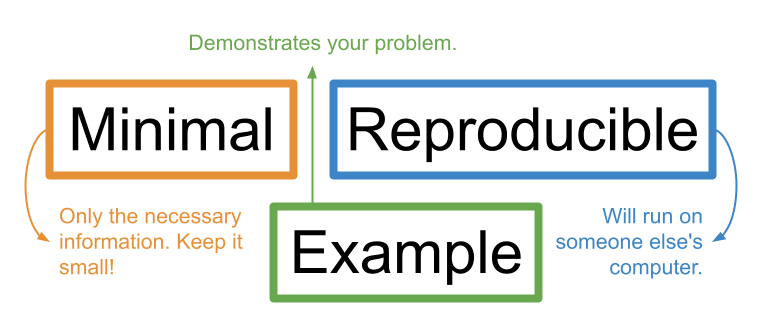
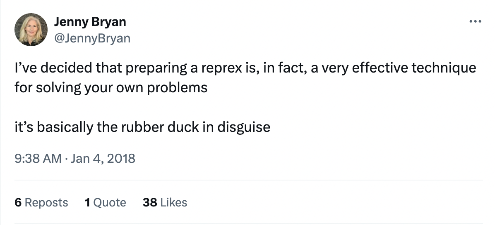

:::::::::::::::::::::::::::::::::::::: questions 
- What steps can you take to solve problems in your code?
- What is a minimal reproducible example?
- Why are minimal reproducible examples important?
- What variables are included in the Portal Project dataset?
::::::::::::::::::::::::::::::::::::::::::::::::

::::::::::::::::::::::::::::::::::::: objectives
- Understand the high-level process for getting unstuck in R.
- Define each key characteristic of a minimal reproducible example.
- Explain why minimal reproducible examples are central to getting help from others.
- Load in the rodent survey data and briefly explain its contents.
::::::::::::::::::::::::::::::::::::::::::::::::

Mickey is an ecology researcher who has just started in a new lab. Mickey's lab has been working for many years with data from the [Portal Project](https://portal.weecology.org/), a long-term research study of rodents in Portal, Arizona. Mickey is particularly interested in learning about rodent morphology. For now, they are getting familiar with the dataset by doing some descriptive analyses and visualizations. 

Mickey starts by loading the data so they can begin to explore it. They also load the {tidyverse}, a set of packages that will be useful for wrangling and visualizing the data.

::: instructor
Loading the entire {tidyverse} here, rather than a few component packages, is an intentional over-complication so that we can teach learners to simplify their packages later. Learners should have {tidyverse} installed, as per the setup instructions.
:::

```{r eval = F, message = F, warning = F}
library(tidyverse)

surveys <- read_csv("data/surveys_complete_77_89.csv") 
```

Mickey has some past experience in R, but this project will require more data analysis than they have done before. Mickey attended a Carpentries workshop, "Data Analysis and Visualization in R for Ecologists," and they feel comfortable with the fundamentals of coding in R. Still, they are a little nervous about starting this project. 

:::::::::::::::::::::::::::::::::::::: callout 
### Prerequisites and target audience

This workshop assumes some prior experience with working in R and RStudio. We will assume you've taken the equivalent of the Data Analysis and Visualization in R for Ecologists workshop and are comfortable with basic commands, and we won't necessarily explain every line of code in detail.

If you're much more experienced in R, this workshop is still for you! Even expert coders may not always know how to get unstuck. We hope this workshop will be useful to people with a variety of coding backgrounds.
::::::::::::::::::::::::::::::::::::::::::::::::

Sometimes, Mickey's code doesn't work as expected and they go to their colleague, Remy, for help. Remy has spent many hours sitting with Mickey, helping to work through various errors. But soon, Remy will be starting a big project, and soon they won't have as much time to help with debugging. 

::: instructor
The following exercises are optional, but they can are useful for getting learners settled in.
:::

:::::::::::::::::::::::::::::::::::::: challenge 
### Exercise 1 (think, pair, share): When you get stuck

When you're coding in R and you get stuck, what are some things that you do to get help or get unstuck?
::::::::::::::::::::::::::::::::::::::::::::::::

:::::::::::::::::::::::::::::::::::::: challenge 
### Exercise 2 (think, pair, share): Helping someone else

Think about a time that you helped someone else with their code. What information did you need to know in order to help?
(If you have never helped someone else with their code, think about a time that someone helped you--what information did they need to know in order to help?)
::::::::::::::::::::::::::::::::::::::::::::::::


To help Mickey get more comfortable troubleshooting their own code, Remy suggests some steps to follow the next time they get stuck. Remy calls this the "Road Map to Getting Unstuck in R."


Remy explains that the road map includes two main phases. First, there is guidance about "code first aid." This includes understanding types of errors, reading function documentation, investigating error messages, and running through code line by line to diagnose problems.

Sometimes, these first aid steps are not enough to solve your problem. One of the most frustrating parts of learning to code is getting stuck and not knowing what to do! Luckily, there are many people in the R and data science communities who are happy to help, as long as you give them the right information. But figuring out how to ask a good question can feel even harder than the original problem that got you stuck in the first place. That's why the second part of Remy's road map includes guidance on how to create a **minimal reproducible example** (also known as a **reprex**). 

A minimal reproducible example is a piece of code that demonstrates the problem you are facing, includes all necessary information to show the problem but nothing extra, and will run easily on someone else's computer.



Minimal reproducible examples are very important tools to get help when you're stuck on a coding problem.

- Stripping the code and data down to their simplest (*minimal*) parts makes it easy for a helper to zero in on what might be going wrong.

- Making your example *reproducible* allows a helper to run your code on their own computer so they can "feel your pain" and understand what's going wrong. Even experts often have to "tinker" with code in order to fix it. Providing a reprex makes that "tinkering" easy, which makes it more likely that a helper will take the time to assist you.

- The process of making a minimal reproducible example often gives you insight into your own code. Often, you might end up solving the problem yourself, without even needing to ask for help.

::: callout
### Rubber duck debugging

The phenomenon of solving one’s own problem during the process of trying to explain it to someone else is often called “rubber duck debugging.” This is a reference to a story about programmers who would keep rubber ducks on their desks to explain coding problems to. Jenny Bryan refers to reprexes as “basically the rubber duck in disguise,” because they force you to explain your problem to someone else, often solving it in the process.

Jenny Bryan shares many other insights about reprexes in her 2018 talk ["Help me help you: Creating reproducible examples."](https://www.youtube.com/watch?v=5gqksthQ0cM)
:::



:::callout
### Helpers

There are lots of people who might help you with your code: friends, colleagues, mentors, or total strangers online. In this lesson, we will use the term "helper" to refer to the person who is helping you to debug your code. Helpers are the target audience for your minimal reproducible example.
:::

Remy emphasizes to Mickey that they are still happy to be a helper, but that since they won't have as much time to devote to debugging in the future, following this road map first will make the helping process more efficient. Hopefully, it will also make Mickey into a more confident coder! 

Before heading off to their own work, Remy also introduces Mickey to the dataset they've just loaded in.

```{r}
glimpse(surveys)
min(surveys$year)
max(surveys$year)
```

Remy explains that the dataset is made up of many individual rodent records (`record_id`). The date of each record is given by the `month`, `day`, and `year` columns. 

The dataset includes data from a number of different study plots that had different treatments applied: plot IDs are given by the `plot_id` column, and the type of treatment is specified in `plot_type`. 

There is information about the `genus` and `species` of each individual caught, as well as higher-level `taxa` information and a short-form `species_id` code. 

For each individual caught, the field crew took `weight`, `sex` and `hindfoot_length` measurements, although those measurements are sometimes missing.

The dataset contains 16,878 rodent observations ranging across years from 1977 through 1989. 

With an introduction to the dataset and a road map to guide them if they get stuck, Mickey feels ready to start coding!

::::::::::::::::::::::::::::::::::::: keypoints 
- Applying some "code first aid" can help address problems in your code.Add commentMore actions
- Helpers can more easily debug your code if you provide them with a small example of the problem (a "reprex") that they can tinker with themselves.
- In the process of building a reprex, you may find the solution yourself.
- In the rest of this lesson, we will be working through a "road map" to getting unstuck that includes code first aid and the process of making a reprex.
- The `surveys` dataset includes records of rodents captured in a variety of experimental plots over a 12-year period, including some data about each rodent's sex and morphology.
::::::::::::::::::::::::::::::::::::::::::::::::
