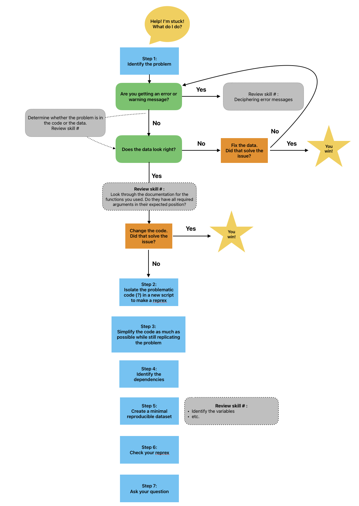

::: questions
- Why is it important to make a minimal code example?
- Which part of my code is causing the problem?
- Which parts of my code should I include in a minimal example?
- How can I tell whether a code snippet is reproducible or not?
- How can I make my code reproducible?
:::

::: objectives
- Explain the value of a minimal code snippet.
- Identify the problem area of a script.
- Identify supporting parts of the code that are essential to include.
- Simplify a script down to a minimal code example.
- Evaluate whether a piece of code is reproducible as is or not. If not, identify what is missing.
- Edit a piece of code to make it reproducible
- Have a road map to follow to simplify your code.
- Describe the {reprex} package and its uses
:::

```{r echo = FALSE, message = FALSE}
library(ggplot2)
library(dplyr)
rodents <- read.csv("data/surveys_complete_77_89.csv")
rodents <- rodents %>% filter(taxa == "Rodent")
```

Mickey is interested in understanding how kangaroo rat weights differ across species and sexes, so they create a quick visualization.

```{r}
ggplot(rodents, aes(x = species, fill = sex))+
  geom_bar()
```
Whoa, this is really overwhelming! Mickey forgot that the dataset includes data for a lot of different rodent species, not just kangaroo rats. Mickey is only interested in two kangaroo rat species: _Dipodomys ordii_ (Ord's kangaroo rat) and _Dipodomys spectabilis_ (Banner-tailed kangaroo rat). 

Mickey also notices that there are three categories for sex: F, M, and what looks like a blank field when there is no sex information available. For the purposes of comparing weights, Mickey wants to focus only rodents of known sex.

Mickey filters the data to include only the two focal species and only rodents whose sex is F or M.

```{r}
rodents_subset <- rodents %>%
  filter(species == c("ordii", "spectabilis"),
         sex == c("F", "M"))
```

Because these scientific names are long, Mickey also decides to add common names to the dataset. They start by creating a data frame with the common names, which they will then join to the `rodents_subset` dataset:

```{r}
## Adding common names
common_names <- data.frame(species = unique(rodents_subset$species), common_name = c("Ord's", "Banner-tailed"))
common_names
```

But looking at the `common names` dataset reveals a problem!

:::challenge
### Exercise 1a: Applying code first aid

1. Is this a syntax error or a semantic error? Explain why.
2. What "code first aid" steps might be appropriate here? Which ones are unlikely to be helpful?
:::

Mickey re-orders the names and tries the code again. This time, it works! Now they can join the common names to `rodents_subset`.

```{r}
common_names <- data.frame(species = sort(unique(rodents_subset$species)), common_name = c("Ord's", "Banner-Tailed"))
rodents_subset <- left_join(rodents_subset, common_names, by = "species")
```

Before moving on to answering their research question about kangaroo rat weights, Mickey also wants to create a date column, since they realized that having the dates stored in three separate columns (`month`, `day`, and `year`) might be hard for future analysis. They want to use `{lubridate}` to parse the dates. But here, too, they run into trouble.

```{r error = T}
rodents_subset <- rodents_subset %>%
  mutate(date = lubridate(paste(year, month, day, sep = "-")))
```

:::instructor
Because these are fairly simple errors, more advanced learners may quickly "see" the solution and may need to be reminded to think through the exercise step by step and consider what steps could be helpful. Optionally, they can also be assigned the extra challenge exercise.
:::

:::challenge
### Exercise 1b: Applying code first aid, part 2

1. Is this a syntax error or a semantic error? Explain why.
2. What "code first aid" steps might be appropriate here? 
3. What would be your next step to fix this error, if you were Mickey?
:::

:::challenge
### Exercise 1c: Applying code first aid, part 2 (extra challenge)

Mickey tried several methods to create a date column. Here's one of them.
```{r error = T}
test <- rodents_subset %>%
  mutate(date = lubridate::as_date(paste(day, month, year)))
```

1. What type of error is this?
2. What do you learn from the warning message? Why do you think this code causes a warning message, rather than an error message?
3. Try some code first aid steps. What do you think happened here? How did you figure it out?
:::

Mickey reads some of the `{lubridate}` documentation and changes their code so that the `date` column is created correctly.

```{r}
rodents_subset <- rodents_subset %>%
  mutate(date = lubridate::ymd(paste(year, month, day, sep = "-")))
```

Now that the dataset is cleaned, Mickey is ready to start learning about kangaroo rat weights!

They start by running a quick linear regression to predict `weight` based on `species` and `sex`.

```{r}
weight_model <- lm(weight ~ common_name + sex, data = rodents_subset)
summary(weight_model) 
```

The negative coefficient for `common_nameOrd's` tells Mickey that Ord's kangaroo rats are significantly less heavy than Banner-tailed kangaroo rats.

But something is wrong with the coefficients for sex. Why is everything NA for `sexM`?

When Mickey visualizes the data, they see a problem in the graph, too. As the model showed, Ord's kangaroo rats are significantly smaller than Banner-tailed kangaroo rats. But something is definitely wrong! Because the boxes are colored by sex, we can see that all of the Banner-tailed kangaroo rats are male and all of the Ord's kangaroo rats are female. That can't be right! What are the chances of catching all one sex for two different species?

```{r}
rodents_subset %>%
  ggplot(aes(y = weight, x = common_name, fill = sex)) +
  geom_boxplot()
```

Mickey confirms this with a two-way frequency table.

```{r}
table(rodents_subset$sex, rodents_subset$species)
```

To double check, Mickey looks at the original dataset.

```{r}
table(rodents$sex, rodents$species)
```

Not only were there originally males and females present from both _ordii_ and _spectabilis_, but the original numbers were way, way higher! It looks like somewhere along the way, Mickey lost a lot of observations.

[WORKING THROUGH CODE FIRST AID STEPS HERE]
Mickey is feeling overwhelmed and not sure where their code went wrong. They were able to fix the errors and warning messages that they encountered so far, but this one seems more complicated, and there has been no clear indication of what went wrong. They work their way through the code first aid steps, but they are not able to solve the problem.

They decide to consult Remy's road map to figure out what to do next.



Since code first aid was not enough to solve this problem, it looks like it's time to ask for help using a *reprex*.

# Making a reprex

## Simplify the code

When asking someone else for help, it is important to simplify your code as much as possible to make it easier for the helper to understand what is wrong. Simplifying code helps to reduce frustration and overwhelm when debugging an error in a complicated script. The more that we can make the process of helping easy and painless for the helper, the more likely that they will take the time to help.

:::callout
Depending on how closely you have been following the lesson and which challenges you have attempted, your script may not look exactly like Mickey's. That's okay!
:::

Mickey has written a lot of code so far. The code is also a little messy--for example, after fixing the previous errors, they sometimes commented out the old code and kept it for future reference.

### Create a new script

To make the task of simplifying the code less overwhelming, let's create a separate script for our reprex. This will let us experiment with simplifying our code while keeping the original script intact.

Let's create and save a new, blank R script and give it a name, such as "reprex-script.R"

:::::::::::::::::::::::::::::::::::::callout
## Callout: Making an R script

There are several ways to make an R script:

- File > New File > R Script
- Click the white square with a green plus sign at the top left corner of your RStudio window
- Use a keyboard shortcut: Cmd + Shift + N (on a Mac) or Ctrl + Shift + N (on Windows)
::::::::::::::::::::::::::::::::::::::::::: 

We're going to start by copying over all of our code, so we have an exact copy of the full analysis script.

```{r eval = F}
# Minimal reproducible example script
# Load packages and data
library(ggplot2)
library(dplyr)
rodents <- read.csv("data/surveys_complete_77_89.csv")

# XXX ADD PETER'S EPISODE CODE HERE

## Filter to only rodents
rodents <- rodents %>% filter(taxa == "Rodent")

# Visualize sex by species
ggplot(rodents, aes(x = species, fill = sex))+
  geom_bar()

# Subset to species and sexes of interest
rodents_subset <- rodents %>%
  filter(species == c("ordii", "spectabilis"),
         sex == c("F", "M"))

# Add common names
# common_names <- data.frame(species = unique(rodents_subset$species), common_name = c("Ord's", "Banner-tailed"))
# common_names # oops, this looks wrong!
common_names <- data.frame(species = sort(unique(rodents_subset$species)), common_name = c("Ord's", "Banner-Tailed"))
common_names
rodents_subset <- left_join(rodents_subset, common_names)

# Add a date column
# rodents_subset <- rodents_subset %>%
#   mutate(date = lubridate(paste(year, month, day, sep = "-"))) # that didn't work!

rodents_subset <- rodents_subset %>%
  mutate(date = lubridate::ymd(paste(year, month, day, sep = "-")))

# Predict weight by species and sex, and make a plot
weight_model <- lm(weight ~ common_name + sex, data = rodents_subset)
summary(weight_model) 
rodents_subset %>%
  ggplot(aes(y = weight, x = common_name, fill = sex)) +
  geom_boxplot() # wait, why does this look weird?

# Investigate
table(rodents_subset$sex, rodents_subset$species)
table(rodents$sex, rodents$species)
```

Now, we will follow a process: 
1. Identify the symptom of the problem.
2. Remove a piece of code to make the reprex more minimal.
3. Re-run the reprex to make sure the reduced code still demonstrates the problem--check that the symptom is still present.

In this case, the *symptom* is that we are *missing rows in `rodents_subset`* that were present in `rodents` and should not have been removed!

Let's start by identifying pieces of code that we can probably remove. A good start is to look for lines of code that do not create variables for later use, or lines that add complexity to the analysis that is not relevant to the problem at hand.

We can start by removing the broken code that we commented out earlier. Also, adding the date column is not directly relevant to the current problem. Let's go ahead and remove those pieces of code. Now our script looks like this:

```{r eval = F}
# Minimal reproducible example script
# Load packages and data
library(ggplot2)
library(dplyr)
rodents <- read.csv("data/surveys_complete_77_89.csv")

# XXX ADD PETER'S EPISODE CODE HERE

## Filter to only rodents
rodents <- rodents %>% filter(taxa == "Rodent")

# Visualize sex by species
ggplot(rodents, aes(x = species, fill = sex))+
  geom_bar()

# Subset to species and sexes of interest
rodents_subset <- rodents %>%
  filter(species == c("ordii", "spectabilis"),
         sex == c("F", "M"))

# Add common names
common_names <- data.frame(species = sort(unique(rodents_subset$species)), common_name = c("Ord's", "Banner-Tailed"))
common_names
rodents_subset <- left_join(rodents_subset, common_names)

# Predict weight by species and sex, and make a plot
weight_model <- lm(weight ~ common_name + sex, data = rodents_subset)
summary(weight_model) 
rodents_subset %>%
  ggplot(aes(y = weight, x = common_name, fill = sex)) +
  geom_boxplot() # wait, why does this look weird?

# Investigate
table(rodents_subset$sex, rodents_subset$species)
table(rodents$sex, rodents$species)
```

When we run this code, we can confirm that it still demonstrates our problem. There are still many rows missing from `rodents_subset`.

We've made progress on minimizing our code, but we still have a ways to go. This script is still pretty long! Let's identify more pieces of code that we can remove.

:::::challenge
## Exercise 2: Minimizing code

Which other lines of code can you remove to make this script more minimal? After removing each one, be sure to re-run the code to make sure that it still reproduces the error.

:::solution
- [Peter's episode code]
- Visualizing sex by species (ggplot) can be removed because it generates a plot but does not create any variables that are used later.
- Filtering to only rodents can be removed because later we filter to only two species in particular
- Adding common names can be removed because we didn't actually use those common names. This one is tricky because technically we did use the common names in the rodents_subset plot. But is that plot *really* necessary? We can still demonstrate the problem using the table() lines of code at the end. Also, we could still make the equivalent plot using the `species` column instead of the `common_name` column, and it would demonstrate the same thing!
- The weight model and the summary can be removed

A totally minimal script would look like this:
```{r eval = F}
rodents <- read.csv("data/surveys_complete_77_89.csv")

rodents_subset <- rodents %>%
  filter(species == c("ordii", "spectabilis"),
         sex == c("F", "M"))

table(rodents_subset$sex, rodents_subset$species)
table(rodents$sex, rodents$species)
```
:::

:::

Great, now we have a totally minimal script!

However, we're not done yet. 

:::challenge
### Exercise 3: The problem area is not enough

Let's suppose that Mickey has created the minimal problem area script shown above. They email this script to Remy so that Remy can help them debug the code.

Remy opens up the script and tries to run it on their computer, but it doesn't work.
- What do you think will happen when Remy tries to run the code from this reprex script?
- What do you think Mickey should do next to improve the minimal reproducible example?
:::

We haven't yet included enough code to allow a helper, such as Remy, to run the code on their own computer. If Remy tries to run the reprex script in its current state, they will encounter errors because they don't have access to the same R environment that Mickey does. 

### Include dependencies

R code consists primarily of **functions** and **variables**. In order to make our minimal examples truly _reproducible_, we have to give our helpers access to all the functions and variables that are necessary to run our code.

First, let's talk about **functions**. Functions in R typically come from packages. You can access them by loading the package into your environment. 

To make sure that your helper has access to the packages necessary to run your reprex, you will need to include calls to `library()` for whichever packages are used in the code. For example, if your code uses the function `lmer` from the `{lme4}` package, you would have to include `library(lme4)` at the top of your reprex script to make sure your helper has the `{lme4}` package loaded and can run your code.

::: callout
### Callout: Default packages

Some packages, such as `{base}` and `{stats}`, are loaded in R by default, so you might not have realized that a lot of functions, such as `dim`, `colSums`, `factor`, and `length` actually come from those packages!

You can see a complete list of the functions that come from the `{base}` and `{stats}` packages by running `library(help = "base")` or `library(help = "stats")`.
:::

Let's do this for our own reprex. We can start by identifying all the functions used, and then we can figure out where each function comes from to make sure that we tell our helper to load the right packages.

The first function used in our example is `ggplot()`, which comes from the package `{ggplot2}`. Therefore, we know we will need to add `library(ggplot2)` at the top of our script.

The function `geom_boxplot()` also comes from `{ggplot2}`. We also used the function `table()`. Running `?table` tells us that the `table` function comes from the package `{base}`, which is automatically installed and loaded when you use R--that means we don't need to include `library(base)` in our script.

Our reprex script now looks like this:

```{r}
# Mickey's reprex script

# Load necessary packages to run the code
library(ggplot2)

rodents_subset %>%
  ggplot(aes(y = weight, x = common_name, fill = sex)) +
  geom_boxplot() # wait, why does this look weird?

# Investigate
table(rodents_subset$sex, rodents_subset$species)
table(rodents$sex, rodents$species)
```

::::::::::::::::::::::::::::::::::::::::::: callout
### Callout: Installing vs. loading packages

But what if our helper doesn't have all of these packages installed? Won't the code not be reproducible?

Typically, we don't include `install.packages()` in our code for each of the packages that we include in the `library()` calls, because `install.packages()` is a one-time piece of code that doesn't need to be repeated every time the script is run. We assume that our helper will see `library(specialpackage)` and know that they need to go install "specialpackage" on their own.

Technically, this makes that part of the code not reproducible! But it's also much more "polite". Our helper might have their own way of managing package versions, and forcing them to install a package when they run our code risks messing up our workflow. It is a common convention to stick with `library()` and let them figure it out from there.
:::::::::::::::::::::::::::::::::::::::::::

::::::::::::::::::::::::::::::::::::::::::: challenge
### Exercise 4: Which packages are essential?

In each of the following code snippets, identify the necessary packages (or other code) to make the example reproducible.

a.
```
weight_model <- lm(weight ~ common_name + sex, data = rodents_subset)
tab_mod(weight_model)
```

b.
```
mod <- lmer(weight ~ hindfoot_length + (1|plot_type), data = rodents)
summary(mod)
```

c.
```
rodents_processed <- process_rodents_data(rodents)
glimpse(rodents_processed)
```

This exercise should take about 10 minutes.
:::solution
a. `lm` is part of base R, so there's no package needed for that. `tab_mod` comes from the package `sjPlot`. You could add `libary(sjPlot)` to this code to make it reproducible.
b. `lmer` is a linear mixed modeling function that comes from the package `lme4`. `summary` is from base R. You could add `library(lme4)` to this code to make it reproducible.
c. `process_rodents_data` is not from any package that we know of, so it was probably an originally-created function. In order to make this example reproducible, you would have to include the definition of `process_rodents_data`. `glimpse` is probably from `dplyr`, but it's worth noting that there is also a `glimpse` function in the `pillar` package, so this might be ambiguous. This is another reason it's important to specify your packages--if you leave your helper guessing, they might load the wrong package and misunderstand your error!
:::
:::::::::::::::::::::::::::::::::::::::::::

Including `library()` calls will definitely help Remy run the code. But this code still won't work as written because Remy does not have access to the same *objects* that Mickey used in the code.

The code as written relies on `rodents_subset`, which Remy will not have access to if they try to run the code. That means that we've succeeded in making our example *minimal*, but it is not *reproducible*: it does not allow someone else to reproduce the problem!

[Transition to minimal data episode]

:::::::::::::::::::::::::::::::::::::::::::challenge
### Exercise 5: Reflection

Let's take a moment to reflect on this process.

- What's one thing you learned in this episode? An insight; a new skill; a process?

- What is one thing you're still confused about? What questions do you have?

This exercise should take about 5 minutes.
::::::::::::::::::::::::::::::::::::::::::: 

:::keypoints
- Making a reprex is the next step after trying code first aid.
- In order to make a good reprex, it is important to simplify your code
- Simplify code by removing parts not directly related to the question
- Give helpers access to the functions used in your code by loading all necessary packages
:::
