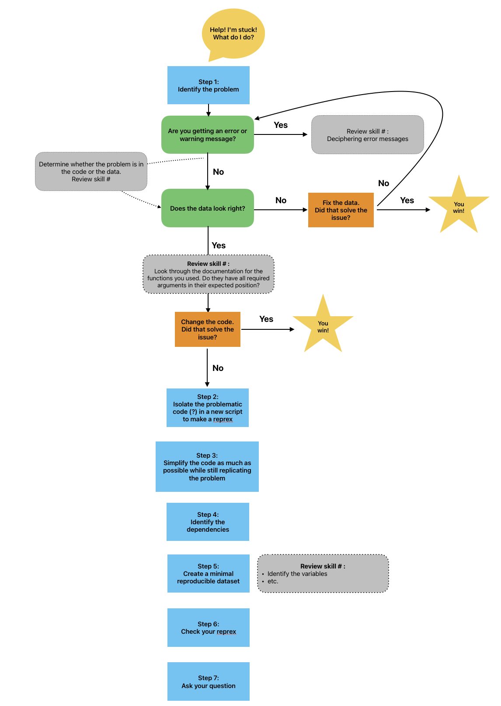

::: questions
- # XXX updateme
- Why is it important to make a minimal code example?
- Which part of my code is causing the problem?
- Which parts of my code should I include in a minimal example?
- How can I tell whether a code snippet is reproducible or not?
- How can I make my code reproducible?
:::

::: objectives
- # XXX updateme
- Explain the value of a minimal code snippet.
- Identify the problem area of a script.
- Identify supporting parts of the code that are essential to include.
- Simplify a script down to a minimal code example.
- Evaluate whether a piece of code is reproducible as is or not. If not, identify what is missing.
- Edit a piece of code to make it reproducible
- Have a road map to follow to simplify your code.
- Describe the {reprex} package and its uses
:::

```{r echo = FALSE}
library(ggplot2)
library(dplyr)
rodents <- read.csv("data/surveys_complete_77_89.csv")
rodents <- rodents %>% filter(taxa == "Rodent")
```

Mickey is interested in understanding how kangaroo rat weights differ across species and sexes, so they create a quick visualization.

```{r}
ggplot(rodents, aes(x = species, fill = sex))+
  geom_bar()
```
Whoa, this is really overwhelming! Mickey forgot that the dataset includes data for a lot of different rodent species, not just kangaroo rats. Mickey is only interested in two kangaroo rat species: _Dipodomys ordii_ (Ord's kangaroo rat) and _Dipodomys spectabilis_ (Banner-tailed kangaroo rat). 

Mickey also notices that there are three categories for sex: F, M, and what looks like a blank field when there is no sex information available. For the purposes of comparing weights, Mickey wants to focus only rodents of known sex.

Mickey filters the data to include only the two focal species and only rodents whose sex is F or M.

```{r}
rodents_subset <- rodents %>%
  filter(species == c("ordii", "spectabilis"),
         sex == c("F", "M"))
```

Because these scientific names are long, Mickey also decides to add common names to the dataset. They start by creating a data frame with the common names, which they will then join to the `rodents_subset` dataset:

```{r}
common_names <- data.frame(species = unique(rodents_subset$species), common_name = c("Ord's", "Banner-tailed"))
common_names
```

But looking at the `common names` dataset reveals a problem!

:::challenge
## Applying code first aid

1. Is this a syntax error or a semantic error? Explain why.
2. What "code first aid" steps might be appropriate here? Which ones are not helpful?
:::

Mickey realizes they need to re-order the names, so they try the code again. This time, it works and they join the common names to `rodents_subset`.

```{r}
common_names <- data.frame(species = sort(unique(rodents_subset$species)), common_name = c("Ord's", "Banner-Tailed"))
common_names
rodents_subset <- left_join(rodents_subset, common_names)
```

Before moving on to answering their research question about kangaroo rat weights, Mickey also wants to create a date column, since they realized that having the dates stored in three separate columns (`month`, `day`, and `year`) might be hard for future analysis. They want to use `{lubridate}` to parse the dates. But here, too, they run into trouble.

```{r error = T}
rodents_subset <- rodents_subset %>%
  mutate(date = lubridate(paste(year, month, day, sep = "-")))
```

:::instructor note
Because these are fairly simple errors, some learners (especially more advanced coders) may quickly "see" the solution and may need to be reminded to think through the exercise step by step and consider what steps could be helpful. Optionally, they can also be assigned the extra challenge exercise
:::

:::challenge
## Applying code first aid, part 2

1. Is this a syntax error or a semantic error? Explain why.
2. What "code first aid" steps might be appropriate here? 
3. What would be your next step to fix this error, if you were Mickey?
:::

:::challenge
## Applying code first aid, part 2 (extra challenge)

Mickey tried several methods to create a date column. Here's one of them.
```{r error = T}
test <- rodents_subset %>%
  mutate(date = lubridate::as_date(paste(day, month, year)))
```

1. What type of error is this?
2. What do you learn from the warning message? Why do you think this code causes a warning message, rather than an error message?
3. Try some code first aid steps. What do you think happened here? How did you figure it out?
:::

Mickey reads some of the `{lubridate}` documentation and corrects their code so that the `date` column is created correctly.

```{r}
rodents_subset <- rodents_subset %>%
  mutate(date = lubridate::ymd(paste(year, month, day, sep = "-")))
```

Now that the dataset is cleaned, Mickey is ready to start learning about kangaroo rat weights!

They start by running a quick linear regression to predict `weight` based on `species` and `sex`.

```{r}
weight_model <- lm(weight ~ common_name + sex, data = rodents_subset)
summary(weight_model) 
```

The negative coefficient for `common_nameOrd's` tells Mickey that Ord's kangaroo rats are significantly less heavy than Banner-tailed kangaroo rats.

But something looks wrong with the coefficients for sex! Why is everything NA for `sexM`?

Mickey realizes that before creating a model, they should have re-visualized the dataset to make sure everything looked correct. They make a boxplot of kangaroo rat weights by species and sex, putting the species common names on the x axis and coloring by sex. They expect to see one box for each species-sex combination.

```{r}
rodents_subset %>%
  ggplot(aes(y = weight, x = common_name, fill = sex)) +
  geom_boxplot()
```

As the model made clear, Ord's kangaroo rats are significantly smaller than Banner-tailed kangaroo rats. But something is definitely wrong! The boxes are colored by sex, and it looks like all of the Banner-tailed kangaroo rats are male and all of the Ord's kangaroo rats are female. That can't be right! What are the chances of catching all one sex for two different species?

Mickey creates a two-way frequency table to see the raw numbers, and sure enough, there is only one sex for each species.
```{r}
table(rodents_subset$sex, rodents_subset$species)
```

What did the species-sex breakdown look like for the original dataset, before we subsetted it to just these two species?

```{r}
table(rodents$sex, rodents$species)
```

Not only were there originally males and females present from both _ordii_ and _spectabilis_, but the original numbers were way, way higher! It looks like somewhere along the way, Mickey lost a lot of observations.

[WORKING THROUGH CODE FIRST AID STEPS HERE]
Mickey is feeling overwhelmed and not sure where their code went wrong. They were able to fix the errors and warning messages that they encountered so far, but this one seems more complicated, and there has been no clear indication of what went wrong. They work their way through the code first aid steps

They decide to consult Remy's road map to figure out what to do next.



Since code first aid was not enough to solve this problem, it looks like it's time to ask for help using a *reprex*.


## Why is it important to simplify code?

In order to get help from Jordan, we're going to need to do some work up front to make things easier for them. In general, learning how to simplify your code is one of the most important parts of making a minimal reproducible example, asking others for help, and helping yourself.

Debugging is a time when it's common to have to read through long and complex code (either your own or someone else's). The more we can reduce their frustration and overwhelm and make the experience of solving errors easy and painless, the more likely that others will want to take the time to help us. Helpers are doing us a favor--why put barriers in their way?

## A road map for simplifying your code

Sometimes, it can be challenging to know where to start simplifying your code. In this episode, we're going to walk through a road map for breaking your code down to its simplest form while making sure that 1) it still runs, and 2) it reproduces the problem you care about solving.

For now, we'll go through this road map step by step. At the end, we'll review the whole thing. One takeaway from this lesson is that there is a step by step process to follow, and you can refer back to it if you feel lost in the future.

### Step 0. Create a separate script

To begin creating a simpler piece of code to show Jordan, let's create a separate script. We can separate out small pieces of the code and craft the perfect minimal example while still keeping the original analysis intact.

Create and save a new, blank R script and give it a name, such as "reprex-script.R"

```{r}
# This script will contain my minimal reproducible example.
# Created by Mishka on 2024-12-17
```

:::::::::::::::::::::::::::::::::::::callout
## Creating a new R script
There are several ways to make an R script
- File > New File > R Script
- Click the white square with a green plus sign at the top left corner of your RStudio window
- Use a keyboard shortcut: Cmd + Shift + N (on a Mac) or Ctrl + Shift + N (on Windows)
::::::::::::::::::::::::::::::::::::::::::: 

### Step 1. Identify the problem area

Now that we have a script, let's zero in on what's broken.

First, we should use some of the techniques we learned in the "Identify the Problem" episode and see if they help us solve our error.

XXX FIXME: Peter, let's make sure this follows nicely from your lesson. 
- Look for error messages or warnings --> there aren't any
- Google it --> not really informative

In this case, the debugging tips we learned weren't enough to help us figure out what was wrong with our code.

This is quite common, especially when you're faced with a **semantic error** (your code runs, but it doesn't produce the correct result).

In this case, we can start by identifying the piece of code that *showed us there was a problem*. We noticed the problem by looking at the plot, so that would be an obvious place to start. But is the plot code really the problem area? Maybe, or maybe not. We know that some weird values are showing up on the plot. That means that either there are weird values in the data that created the plot, or the values in the data looked okay and something happened when we created the plot.

To distinguish between those possibilities, let's take a look at the plot again:

```{r}
# Visualize proportions
prop_spectab %>%
  ggplot(aes(x = year, y = prop, col = plot_type))+
  geom_point()+
  geom_line()+
  theme_minimal()+
  labs(title = "Spectab exclosures did not reduce proportion of\nspectab captures",
       y = "Spectabilis proportion",
       x = "Year",
       color = "Plot type")
```

...and then at the data used to generate that plot
```{r filename = "Console"}
head(prop_spectab)
```

Aha! The `prop` column of `prop_spectab` shows very small values, and those values correspond to the plot we created.

So it looks like the problem is in the data, not in the plot code itself. The plot was just what allowed us to see the problem in our data. This is often the case. Visualizations are important!

So instead of focusing on the plot, let's zoom in on the step right before the plot as our "problem area": the code that created the `prop_spectab` object. Let's copy and paste that section of code into the new script that we just created.

```{r}
# This script will contain my minimal reproducible example.
# Created by Mishka on 2024-12-17

# Calculate proportion of spectabilis caught
head(control_spectab)
prop_spectab <- control_spectab %>%
  group_by(year, plot_type, species_id) %>%
  summarize(total_count = n(), .groups = "drop") %>%
  mutate(prop = total_count/sum(total_count)) %>%
  filter(species_id == "DS") # keep only spectabilis
```

Now the code is much smaller and easier to dig through! You decide to send this updated script along to Jordan. 

> Hi Jordan,
> Sorry about that! You're right, that was a lot of code to dig through. I've narrowed it down now to just focus on the part of the code that was causing the problem. The proportions of k-rats in the prop_spectab data frame are too small to make sense. Can you help me figure out why the proportions are wrong?
> Thank you,
> Mishka
> Attachment: reprex-script.R

Jordan gets your email and opens the script. They try to run your code, but they immediately run into some problems. They write back,

> Hey Mishka,
> This is almost there, but I can't run your code because I don't have the objects and packages it relies on. Can you elaborate on your example to make it runnable?
> Jordan

### Step 2. Identify dependencies

Jordan is right, of course--you gave them a minimal example of your code, but you didn't provide the context around that code to make it runnable for someone else. You need to provide the *dependencies* for your code, including the functions it uses and the datasets it relies on.

R code consists primarily of **functions** and **variables**. Making sure that we give our helpers access to all the functions and variables we use in our minimal code will make our examples truly reproducible.

Let's talk about **functions** first. When we code in R, we use a lot of different functions. Functions in R typically come from packages, and you get access to them by loading the package into your environment. (Some packages, such as `{base}` and `{stats}`, are loaded in R by default, so you might not have realized that a lot of functions, such as `dim`, `colSums`, `factor`, and `length` actually come from those packages!)

::: callout
You can see a complete list of the functions that come from the `{base}` and `{stats}` packages by running `library(help = "base")` or `library(help = "stats")`.
:::

To make sure that your helper has access to the functions necessary for your reprex, you can include a `library()` call in your reprex. 

Let's do this for our own reprex. We can start by identifying all the functions used, and then we can figure out where each function comes from to make sure that we tell our helper to load the right packages.

Here's what our script looks like so far.

```{r}
# This script will contain my minimal reproducible example.
# Created by Mishka on 2024-12-17

# Calculate proportion of spectabilis caught
head(control_spectab)
prop_spectab <- control_spectab %>%
  group_by(year, plot_type, species_id) %>%
  summarize(total_count = n(), .groups = "drop") %>%
  mutate(prop = total_count/sum(total_count)) %>%
  filter(species_id == "DS") # keep only spectabilis
```

You look through the script and list out the following functions:
`head()`
`group_by()`
`summarize()`
`n()`
`mutate()`
`sum()`
`filter()`

:::callout
`%>%` is technically an operator, not a function...
FIXME note: `%>%` is an operator that also needs dplyr to be loaded. It might be relevant because the literal error that Jordan will get first is one about %>% if they don't have that loaded. But it's also exhausting to talk about and it might confuse people. By the time they finish loading {dplyr} for the sake of the other functions, the %>% will be included with {dplyr} and it will no longer be a problem. Hmm...
:::

You remember from your introductory R lesson that `group_by()` and `summarize()` are both functions that come from the `{dplyr}` package, so you can go ahead and add `library(dplyr)` to the top of your script.

```{r}
# This script will contain my minimal reproducible example.
# Created by Mishka on 2024-12-17

# Load packages needed for the analysis
library(dplyr)

# Calculate proportion of spectabilis caught
head(control_spectab)
prop_spectab <- control_spectab %>%
  group_by(year, plot_type, species_id) %>%
  summarize(total_count = n(), .groups = "drop") %>%
  mutate(prop = total_count/sum(total_count)) %>%
  filter(species_id == "DS") # keep only spectabilis
```

You're pretty sure that `mutate()` and `filter()` also come from `{dplyr}`, but you're not sure. And you don't know where `n()` and `sum()` come from at all!

Some functions might be created, or "defined", in your code itself, instead of being contained in a package.  

It's pretty common not to remember where functions come from, especially if they belong to packages you use regularly. Let's try searching for the `sum()` function in the documentation.

In the "Help" tab of your RStudio window (which should be next to the "Packages" and "Viewer" tabs in the bottom right pane of RStudio if you have the default layout), search for "sum".

[INCLUDE SCREENSHOT OF SUM HELP DOCS HERE]

The top of the help file says `sum {base}`, which means that `sum()` is a function that comes from the `{base}` package. That's good for us--everyone has `{base}` loaded by default in R, so we don't need to tell our helper to load any additional packages in order to be able to access sum.

Let's confirm that we remembered correctly about `mutate()` and `filter()` by searching for the documentation on those as well.

Searching for "mutate" quickly shows us the help file for `mutate {dplyr}`, but searching for "filter" gives a long list of possible functions, all called `filter`. You look around a little bit and realize that the `filter` function you're using is also from the `{dplyr}` package. It might be a good idea to explicitly declare that in your code, in case your helper already has one of these other packages loaded.

::: callout
Maybe something about functions masking other functions? Or is that too much?
:::

You can explicitly declare which package a function comes from using a double colon `::`--for example, `dplyr::filter()`. (Declaring the function with a double colon also allows you to use that function even if the package is not loaded, as long as it's installed.)

Let's add that to our script, so that it's really clear which `filter()` we're using.

```{r}
# This script will contain my minimal reproducible example.
# Created by Mishka on 2024-12-17

# Load packages needed for the analysis
library(dplyr)

# Calculate proportion of spectabilis caught
head(control_spectab)
prop_spectab <- control_spectab %>%
  group_by(year, plot_type, species_id) %>%
  summarize(total_count = n(), .groups = "drop") %>%
  mutate(prop = total_count/sum(total_count)) %>%
  dplyr::filter(species_id == "DS") # keep only spectabilis
```

The last function we need to find a source for is `n()`. Searching that in the Help files shows that it also comes from `{dplyr}`. Great! We don't need to consider any other packages, and the `library(dplyr)` line in our reprex script will tell our helper that the `{dplyr}` package is necessary to run our code. 

::::::::::::::::::::::::::::::::::::::::::: callout
## Installing vs. loading packages

But what if our helper doesn't have all of these packages installed? Won't the code not be reproducible?

Typically, we don't include `install.packages()` in our code for each of the packages that we include in the `library()` calls, because `install.packages()` is a one-time piece of code that doesn't need to be repeated every time the script is run. We assume that our helper will see `library(specialpackage)` and know that they need to go install "specialpackage" on their own.

Technically, this makes that part of the code not reproducible! But it's also much more "polite". Our helper might have their own way of managing package versions, and forcing them to install a package when they run our code risks messing up our workflow. It is a common convention to stick with `library()` and let them figure it out from there.
:::::::::::::::::::::::::::::::::::::::::::

::::::::::::::::::::::::::::::::::::::::::: challenge
## Which packages are essential?

In each of the following code snippets, identify the necessary packages (or other code) to make the example reproducible.

- [Example (including an ambiguous function: `dplyr::select()` is a good one because it masks `plyr::select()`)]
- [Example where you have to look up which package a function comes from]
- [Example with a user-defined function that doesn't exist in any package]

This exercise should take about 10 minutes.
:::solution
FIXME
:::
:::::::::::::::::::::::::::::::::::::::::::

::::::::::::::::::::::::::::::::::::::::::: callout
## Installing packages conditionally

There is an alternative approach to installing packages [insert content/example of the if(require()) thing--but note that explaining this properly requires explaining why require() is different from library(), why it returns a logical, etc. and is kind of a rabbit hole that I don't want to go down here.]
::::::::::::::::::::::::::::::::::::::::::: 

Including `library()` calls will definitely help Jordan be able to run your code. But another reason that your code still won't work as written is that Jordan doesn't have access to the same *objects*, or *variables*, that you used in the code.

The piece of code that we copied over to "reprex-script.R" from  "krat-analysis.R" came from line 117. We had done a lot of analyses before then, starting from the raw dataset and creating and modifying new objects along the way. 

You realize that Jordan doesn't have access to `control_spectab`, the dataset that the reprex relies on.

One way to fix this would be to add the code that creates `control_spectab` to the reprex, like this:

```{r}
# This script will contain my minimal reproducible example.
# Created by Mishka on 2024-12-17

# Load packages needed for the analysis
library(dplyr)

# B. For Spectabilis-specific exclosure, we expect a lower proportion of spectabilis there than in the other plots.
control_spectab <- krats %>%
  filter(plot_type %in% c("Control", "Spectab exclosure"))

# Calculate proportion of spectabilis caught
head(control_spectab)
prop_spectab <- control_spectab %>%
  group_by(year, plot_type, species_id) %>%
  summarize(total_count = n(), .groups = "drop") %>%
  mutate(prop = total_count/sum(total_count)) %>%
  dplyr::filter(species_id == "DS") # keep only spectabilis
```

But that doesn't fix the problem either, because now Jordan doesn't have access to `krats`. Let's go back to where `krats` was created, on line 40:

```{r}
# Just kangaroo rats because this is what we are studying
krats <- rodents %>%
  filter(genus == "Dipodomys")
dim(krats) # okay, so that's a lot smaller, great.
glimpse(krats)
```

But there are several other places in the code where we modified `krats`, and we need to include those as well if we want our code to be truly reproducible. For example, on line 47, a date column was added, and on line 70 we removed unidentified k-rats. And even after including those, we would need to go back even farther, because the `rodents` object also isn't something that Jordan has access to! We called the raw data `rodents` after reading it in, and we also made several modifications, such as when we removed non-rodent taxa on line 35.
XXX This example would be better illustrated if we could actually show it breaking... like, if we think we've succeeded in tracing back far enough, and then it doesn't run because e.g. an essential column is missing/different.
XXX This is definitely too much detail... but I do want this section to at least partially feel like "aaaah information overload, too complicated!" because the point is to show how hard it is to trace every object backwards and convince them of the value of using minimal data.

::::::::::::::::::::::::::::::::::::::::::: challenge
## Identifying variables

For each of the following code snippets, identify all the variables used

- [Straightforward example]
- [Example where they use a built-in dataset but it contains a column that that dataset doesn't actually contain, i.e. because it's been modified previously. Might be good to use the `date` column that we put into `krats` for this]

This exercise should take about 5 minutes.
::: solution
TBH maybe we don't need this exercise at all, since we want to just redirect them to minimal data anyway?
:::
::::::::::::::::::::::::::::::::::::::::::: 

This process is confusing and difficult! If you keep tracing each variable back through your script, before you know it, you end up needing to include the entire script to give context, and then your code is no longer minimal.

We can make our lives easier if we realize that helpers don't always need the exact same variables and datasets that we were using, just reasonably good stand-ins. Let's think back to the last episode, where we talked about different ways to create minimal reproducible datasets. We can lean on those skills here to make our example reproducible and greatly reduce the amount of code that we need to include.

:::::::::::::::::::::::::::::::::::::::::::challenge
## Incorporating minimal datasets

What are some ways that you could use a minimal dataset to make this reprex better? What are the advantages and disadvantages of each approach?

This exercise should take about 5 minutes.
::: solution
Could provide the `control_spectab` file directly to Jordan, e.g. via email attachment. 
Advantages: less work, keeps the context, Jordan is a coworker so they probably understand it. 
Disadvantages: file might be large, relies on ability to email file, won't be able to use this method if you post the question online, file contains extra rows/columns that aren't actually necessary to this problem and might therefore be confusing.
  
Could create a new dataset from scratch. 
Advantages:
Disadvantages:
  
Could take a minimal subset of the `control_spectab` data and use `dput` or similar to include it directly
Advantages:
Disadvantages:

Could use a built-in dataset from R
Advantages:
Disadvantages:
:::
::::::::::::::::::::::::::::::::::::::::::: 

You decide that the easiest way to approach this particular problem would be to use a sample dataset to reproduce the problem.

Let's think about how to create a sample dataset that will accurately reproduce the problem.
What columns are needed to create `prop_spectab`, and what do we know about those columns?

```{r}
head(control_spectab)
length(unique(control_spectab$year)) # 13 years
length(unique(control_spectab$species_id)) # three species
length(unique(control_spectab$plot_type)) # two plot types
```

Looks like we use `year`, which is numeric, and `plot_type` and `species_id`, which are both character types but have discrete levels like a factor. We have data from 13 years across two plot types, and there are three species that might occur.

Let's create some vectors. I'm only going to use four years here because 13 seems a little excessive.

I'm going to arbitrarily decide how many species records are present for each year, assign every other row to treatment or control, and randomly select species for each row.
```{r}
years <- 1:4
species <- c("Species A", "Species B", "Species C")
plots <- c("Control", "Treatment")

total_records_per_year <- c(10, 12, 3, 30) # I chose these arbitrarily 
total_rows <- sum(total_records_per_year) # how many total rows will we have?

# Create the fake data using `rep()` and `sample()`.
minimal_data <- data.frame(year = rep(years, times = total_records_per_year),
                      plot_type = rep(plots, length.out = total_rows),
                      species_id = sample(species, size = total_rows, replace = TRUE))
```

We can go ahead and paste that into our reprex script. 

```{r}
# Provide a minimal dataset
years <- 1:4
species <- c("Species A", "Species B", "Species C")
plots <- c("Control", "Treatment")

total_records_per_year <- c(10, 12, 3, 30) # I chose these arbitrarily 
total_rows <- sum(total_records_per_year) # how many total rows will we have?

# Create the fake data using `rep()` and `sample()`.
minimal_data <- data.frame(year = rep(years, times = total_records_per_year),
                      plot_type = rep(plots, length.out = total_rows),
                      species_id = sample(species, size = total_rows, replace = TRUE))
```

And finally, let's change our code to use `minimal_data` instead of `control_spectab`. (While we're at it, let's remove the piece of code that creates `control_spectab`--including a minimal dataset directly means that we don't need that code.)

Let's calculate the proportion of Species A caught, instead of spectabilis.

```{r}
# Calculate proportion of Species A caught
head(minimal_data)
prop_speciesA <- minimal_data %>%
  group_by(year, plot_type, species_id) %>%
  summarize(total_count = n(), .groups = "drop") %>%
  mutate(prop = total_count/sum(total_count)) %>%
  dplyr::filter(species_id == "Species A") # keep only Species A
```

And now let's check to make sure that the code actually reproduces our problem. Remember, the problem was that the proportions of Species A caught seemed to be way too low based on what we knew about the frequency of occurrence of each k-rat species.

When we created our sample data, we randomly allocated species A, B, and C to each row. Even after accounting for the stratification of the years and plot types, we would expect the proportion of Species A caught to be somewhere vaguely around 0.33 in each plot type and year. If we've reproduced our problem correctly, we would see values much lower than 0.33.

```{r}
head(prop_speciesA)
```

Indeed, those proportions look way too low! 3%, 1%... that's an order of magnitude off from what we expect to see here. I think we have successfully reproduced the problem using a minimal dataset. To make things extra easy for Jordan, let's add some comments in the script to point out the problem.

```{r}
# This script will contain my minimal reproducible example.
# Created by Mishka on 2024-12-17

# Load packages needed for the analysis
library(dplyr)

# Provide a minimal dataset
years <- 1:4
species <- c("Species A", "Species B", "Species C")
plots <- c("Control", "Treatment")

total_records_per_year <- c(10, 12, 3, 30) # I chose these arbitrarily 
total_rows <- sum(total_records_per_year) # how many total rows will we have?

# Create the fake data using `rep()` and `sample()`.
minimal_data <- data.frame(year = rep(years, times = total_records_per_year),
                      plot_type = rep(plots, length.out = total_rows),
                      species_id = sample(species, size = total_rows, replace = TRUE)) # Because I assigned the species randomly, we should expect Species A to occur *roughly* 33% of the time.

# Calculate proportion of Species A caught
head(minimal_data)
prop_speciesA <- minimal_data %>%
  group_by(year, plot_type, species_id) %>%
  summarize(total_count = n(), .groups = "drop") %>%
  mutate(prop = total_count/sum(total_count)) %>%
  dplyr::filter(species_id == "Species A") # keep only Species A

head(prop_speciesA) # Species A only occurs 1-3% of the time in each plot type in each year. Why is this off by an order of magnitude? (This is the same problem I was seeing in my real data--the occurrence proportions were way, way too small.)
```

### Step 3. Simplify

We're almost done! Now we have code that runs because it includes the necessary `library()` calls and makes use of a minimal dataset that still allows us to showcase the problem. Our script is almost ready to send to Jordan. 

One last thing we can check is whether there are any other places where we can trim down the minimal example even more to eliminate distractions.

Often, analysis code contains exploratory steps or other analyses that don't directly relate to the problem, such as calls to `head()`, `View()`, `str()`, or similar functions. (Exception: if you're using these directly to show things like dimension changes that help to illustrate the problem).

Some other common examples are exploratory analyses, or extra formatting added to plots that doesn't change their interpretation.

:::callout
When cutting extra lines of code, we have to be careful not to remove anything that would cause the code to no longer reproduce our problem. In general, it's a good idea to comment out the line you think is extraneous, re-run the code, and check that the focal problem persists before removing it entirely.
:::

In our case, the code looks pretty minimal. We do have a call to `head()` at the end, but that's being used to clearly demonstrate the problem, so it should be left in. Trimming down the minimal dataset any further, for example by removing `plot_type` or `year`, would involve changing the analysis code and possibly not reproducing the problem anymore.

---
XXX @XOR @PL: I wish I had picked an example that had some extraneous parts to take out, such as a ggplot call with really long code. Would love to include that. Since I didn't, I think I can take out this entire section of the roadmap, or add it as a bonus exercise that gives a completely different example with a lot of extraneous things to remove. Another option would be to add some fluff to the original code so that we can remove that fluff now. Thoughts/preferences?
---

Great work! We've created a minimal reproducible example. In the next episode, we'll learn about `{reprex}`, a package that can help us double-check that our example is reproducible by running it in a clean environment. (As an added bonus, `{reprex}` will format our example nicely so it's easy to post to places like Slack, GitHub, and StackOverflow.)

More on that soon. For now, let's review the road map that we just practiced.

## Road map review
### Step 0. Create a separate script
  - It helps to have a separate place to work on your minimal code snippet.
  
### Step 1. Identify the problem area
  - Which part of the code is causing the problem? Move it over to the reprex script so we can focus on it.
  
### Step 2. Identify dependencies
  - Make sure that helpers have access to all the functions they'll need to run your code snippet.
  - Make sure helpers can access the variables they'll need to run the code, or reasonable stand-ins.
  
### Step 3. Simplify
  - Remove any extra code that isn't absolutely necessary to demonstrate your problem.

:::::::::::::::::::::::::::::::::::::::::::challenge
## Reflection

Let's take a moment to reflect on this process.

- What's one thing you learned in this episode? An insight; a new skill; a process?

- What is one thing you're still confused about? What questions do you have?

This exercise should take about 5 minutes.
::::::::::::::::::::::::::::::::::::::::::: 


# XXX maybe this story should end with Mishka solving their own problem.


### run an ANOVA or something
XXX Note: There's more to the analysis, and I only managed to walk through one example of an error. Is this example juicy enough? Should we just discard the rest of the analysis?
XXX Note: I actually think the analysis here is wrong and might need to be re-worked--would need to do pairwise comparisons.

#### MODELING ####
counts_mod <- lm(count_per_day ~ plot_type + species_id, data = counts_per_day)
summary(counts_mod)

# with interaction term:
counts_mod_interact <- lm(count_per_day ~ plot_type*species_id, data = counts_per_day)
summary(counts_mod_interact)

summary(counts_mod)
summary(counts_mod_interact)


:::::::::::::::::::::::::::::::::::::callout
## Stepping through code, line by line

Placing your cursor on a line of code and using the keyboard shortcut Cmd + Enter (Mac) or Ctrl + Enter (Windows) will run that line of code *and* it will automatically advance your cursor to the next line. This makes it easy to "step through" your code without having to click or highlight.
::::::::::::::::::::::::::::::::::::::::::: 


::::::::::::::::::::::::::::::::::::::::::: callout
## Computational reproducibility

Every object should be able to map back to either a file, a built-in dataset in R, or another intermediate step. If you found any variables where you weren't able to answer the "Where did this come from?" question, then that's a problem! Did you build a script that mistakenly relied on an object that was in your environment but was never properly defined?

Mapping exercises like this can be a great way to check whether entire script is reproducible. Reproducibility is important in more cases than just debugging! More and more journals are requiring full analysis code to be posted, and if that code isn't reproducible, it will severely hamper other researchers' efforts to confirm and expand on what you've done.

Various packages can help you keep track of your code and make it more reproducible. Check out the [`{targets}`](https://books.ropensci.org/targets/) and [`{renv}`](https://rstudio.github.io/renv/articles/renv.html) packages in particular if you're interested in learning more.
::::::::::::::::::::::::::::::::::::::::::: 
