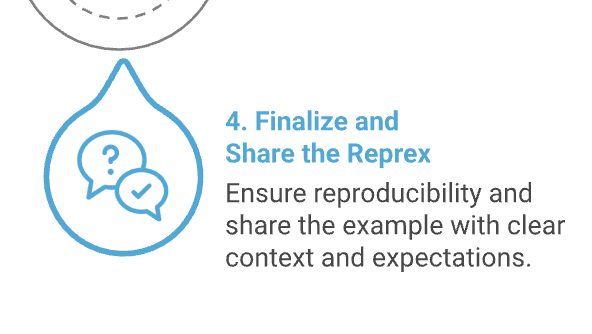

:::::::::::::::::::::::::::::::::::::::: questions

- How can I verify that my example is reproducible?
- How can I easily share a reproducible example with a mentor or helper, or online?
- What information should I include when asking a question?

::::::::::::::::::::::::::::::::::::::::::::::::::

::::::::::::::::::::::::::::::::::::: objectives
- Use the {reprex} package to test whether an example is reproducible.
- Use the {reprex} package to format reprexes for posting online.
- Understand the benefits and drawbacks of different help forums.
- Have a road map to follow when posting a question to make sure it's a good question.
- Understand what the {reprex} package does and doesn't do.
::::::::::::::::::::::::::::::::::::::::::::::::

In the previous episodes, we have worked on creating a minimal reproducible example, also known as a "reprex", to help our researcher friend Mickey debug a problem with their code.

We learned how to 1) identify the problem and try some preliminary fixes, 2) minimize the code, and 3) include a minimal dataset.

In this episode, we will introduce a tool, the `{reprex}` package, that we can use to verify that we've successfully created a minimal reproducible example. The {reprex} package will also help format the code nicely for posting online or sending to a colleague.



When preparing to share a reprex with other people, it is important to remember three principles:

- Reproducibility
- Formatting
- Context

## 1. Reproducibility

Haven't we already talked a lot about reproducibility? 

Yes! We have discussed variables and packages, minimal datasets, and making sure that the problem is meaningfully replicated by the data that you choose. But there are some reasons that a code snippet that appears reproducible in your own R session might not actually be runnable by someone else.

- You forgot to account for the origins of some functions and/or variables. We went through our code methodically, but what if we missed something? It would be nice to confirm that the code is as self-contained as we thought it was.

- Your code depends on some particular characteristic of your R or RStudio environment that is not the same as your helper's environment. For example, you might be using an older version of a package, and the problem could be fixed by reinstalling a newer version. Another package you have loaded could have a function with a conflicting name. Maybe something is up with your operating system, time zone, R version, or RStudio preferences that a helper can't necessarily replicate.

Checking all of these possible causes of errors feels overwhelming, and it may not be obvious how to do it. Even experienced R coders do not always feel comfortable changing their RStudio settings, managing package versions, or accessing hidden configuration files.

Especially for complex problems, it is useful to have a way to double check that our painstakingly-prepared reprexes are actually minimal and reproducible, without manually testing out every contingency in R!

Luckily, the {reprex} package will help you test your reprexes in a clean, isolated environment to make sure they're actually reproducible.

The most important function in the `reprex` package is called `reprex()`, and using it looks a little different from functions in many other packages. `reprex()` automatically recognizes code that you have copied to your computer's **clipboard** and uses it to create a nicely formatted reprex, which it puts onto the clipboard for you to paste elsewhere. Because this happens invisibly, it can be a little hard to keep track of. Here's what's happening behind the scenes.

[DIAGRAM OF THE CLIPBOARD HERE]

Your computer uses the clipboard every time you copy and paste something! What makes `reprex()` different is that it automatically reads and writes from the keyboard; you don't have to manually paste the code into the `reprex()` function.

Let's try it out. We'll first create a *very* minimal reproducible example, such as this one from the [reprex package documentation](https://reprex.tidyverse.org/reference/reprex.html).

```{r}
y <- 1:4
mean(y)
```

To turn this code into a reprex, we can highlight the code and copy it to your clipboard. (e.g. `Cmd + C` on Mac, or `Ctrl + C` on Windows). 

Finally, in your console, type `reprex()`. Leave the parentheses empty. You don't have to paste anything. Hit Enter/Return.

```
# (with the target code snippet copied to your clipboard already...)
# In the console:
reprex()
```

`reprex` will grab the code that you copied to your clipboard and run that code in an _isolated environment_. It will return a nicely formatted reproducible example that includes your code and and any results, plots, warnings, or errors generated.

::: callout
### Callout: The `reprex` package workflow

The `reprex` package workflow takes some getting used to. Instead of copying your code *into* the function, you simply copy it to the clipboard (a mysterious, invisible place to most of us) and then let the blank, empty `reprex()` function go over to the clipboard by itself and find it.

And then the completed, rendered reprex replaces the original code on the clipboard and all you need to do is paste, not copy and paste. 
:::

Let's practice this one more time. Here's some code that makes a boxplot:

```{r message = FALSE}
library(ggplot2)
library(dplyr)
mpg %>% 
  ggplot(aes(x = factor(cyl), y = displ))+
  geom_boxplot()
```

Once again, we can highlight the code snippet, copy it to the clipboard, and then run `reprex()` in the console. 

```
# In the console:
reprex()
```

The result, which was automatically placed onto my clipboard and which I pasted here, looks like this:

``` r
library(ggplot2)
library(dplyr)
#> 
#> Attaching package: 'dplyr'
#> The following objects are masked from 'package:stats':
#> 
#>     filter, lag
#> The following objects are masked from 'package:base':
#> 
#>     intersect, setdiff, setequal, union
mpg %>% 
  ggplot(aes(x = factor(cyl), y = displ))+
  geom_boxplot()
```

<!-- -->

<sup>Created on 2024-12-29 with [reprex v2.1.1](https://reprex.tidyverse.org)</sup>

Nice and neat! It even includes the plot produced, so I don't have to take screenshots and figure out how to attach them to an email.

## 2. {reprex} as a debugging collaborator

The formatting is great, but {reprex} really shines when you treat it as a helpful collaborator in your process of building a reproducible example.

::: challenge
### Exercise 1: Using {reprex} to find problems with a minimal reproducible example

1. If you run the code from the previous example without running the `library(ggplot2)` line, does it still work? Why?

2. Make a prediction: What will happen if you forget to include `library(ggplot2)` in your minimal reproducible example? Try it with the {reprex} package and see. Why did this happen?
::: solution

``` r
library(dplyr)
#> 
#> Attaching package: 'dplyr'
#> The following objects are masked from 'package:stats':
#> 
#>     filter, lag
#> The following objects are masked from 'package:base':
#> 
#>     intersect, setdiff, setequal, union
mpg %>% 
  ggplot(aes(x = factor(cyl), y = displ))+
  geom_boxplot()
#> Error in ggplot(., aes(x = factor(cyl), y = displ)): could not find function "ggplot"
```
<sup>Created on 2024-12-29 with [reprex v2.1.1](https://reprex.tidyverse.org)</sup>

::: 
:::

We get an error message indicating that R cannot find the function `ggplot`! That's because we forgot to load the `ggplot2` package in the reprex.

This happened even though we had `ggplot2` already loaded in our own current RStudio session. `reprex` deliberately ignores any packages already loaded, running the code in a clean, isolated R session that's *different from the R session we've been working in*. This simulates the experience of someone else trying to run your reprex on their own computer. 

## Testing it out

Now that we've met our new reprex-making collaborator, let's use it to test out the reproducible example we created in the previous episode.

Here's the code we wrote:

```{r eval = FALSE}
# Mickey's reprex (1 approach) 

# Required packages to run the code
library(readr)
library(dplyr)

set.seed(1) # ensures accurate data replication

# Create a mock dataset
sample_data <- data.frame(
  record_id = 1:10,
  sex = sample(c('M','F', NA), 10, replace=T)
)

# The problematic code snippet
sample_subset <- sample_data %>% 
  filter(sex == c("F", "M")) 

# Subsetted sample dataset - how many individuals for each sex?
table(sample_subset$sex)
```

It's time to verify if our example is actually reproducible! Let's copy it to the clipboard and run `reprex()`.

```
# In the console:
reprex()
```

It worked!

``` r
# Mickey's reprex (1 approach) 

# Required packages to run the code
library(readr)
library(dplyr)
#> 
#> Attaching package: 'dplyr'
#> The following objects are masked from 'package:stats':
#> 
#>     filter, lag
#> The following objects are masked from 'package:base':
#> 
#>     intersect, setdiff, setequal, union

set.seed(1) # ensures accurate data replication

# Create a mock dataset
sample_data <- data.frame(
  record_id = 1:10,
  sex = sample(c('M','F', NA), 10, replace=T)
)

# The problematic code snippet
sample_subset <- sample_data %>% 
  filter(sex == c("F", "M")) 

# Subsetted sample dataset - how many individuals for each sex?
table(sample_subset$sex)
#> 
#> F 
#> 1
```

<sup>Created on 2025-09-11 with [reprex v2.1.1](https://reprex.tidyverse.org)</sup>

Now we have a beautifully-formatted reprex that includes runnable code and all the context needed to reproduce the problem.

## Including information about your R session

Another nice thing about {reprex} is that you can choose to include information about your R session, in case your error has something to do with your R settings rather than the code itself. You can do that using the `session_info` argument to `reprex()`.

For example, try running the following reprex, setting session_info = TRUE, and observe what happens.

```{r}
library(ggplot2)
library(dplyr)
mpg %>%
  ggplot(aes(x = factor(cyl), y = displ))+
  geom_boxplot()
```

```
# In the console:
reprex(session_info = TRUE)
```
 START HERE WITH KAIJA EDITS 2025-09-11
### Formatting

The output of `reprex()` is markdown, which can easily be copied and pasted into many sites/apps. However, different places have slightly different formatting conventions for markdown. `{reprex}` lets you customize the output of your reprex according to where you're planning to post it.

The default, `venue = "gh"`, gives you "[GitHub-Flavored Markdown](https://github.github.com/gfm/)", which is a particular type of markdown that works well when posted on GitHub. Another format you might want is "r", which gives you a runnable R script, with commented output interleaved with pieces of code.

Check out the formatting options in the help file with `?reprex`, and try out a few depending on the destination of your reprex!

:::callout
### Callout: `reprex` can't do everything for you

People often mention `reprex` as a useful tool for creating reproducible examples, but it can't do the work of crafting the example for you! The package doesn't locate the problem, pare down the code, create a minimal dataset, or automatically include package dependencies.

A better way to think of `reprex` is as a tool to check your work as you go through the process of creating a reproducible example, and to help you polish up the result.
:::

### Context

The final thing to consider when preparing your reproducible example is adding some context so that helpers know a little about your problem and what you're trying to achieve. 

Some context to include:
1. Tell us *a little bit* about your problem. One sentence should be enough. What domain are you working in? What are these data about? What do the relevant variables mean?

This is particularly important if you have provided a subset of your own data instead of creating a minimal dataset from scratch. Your helper will need to interpret the column names and understand what type of data they are looking at.

2. Explain *what you expected to happen*, or what you were trying to achieve, and how it is different from *what happened instead*.

The contrast between what happened and what was supposed to happen is particularly important for semantic errors, in which the "error" is not always obvious when running the code. The code ran--but you have decided that the output is "wrong" somehow, or that it "didn't work". Why? How do you know that? Your helper needs to know that what you got was not what you expected, and they need to know what you expected in order to help you achieve that outcome.

```{r echo = FALSE}
# Chunk included here to load the `rodents` dataset for use
library(ggplot2)
library(dplyr)
rodents <- read.csv("data/surveys_complete_77_89.csv")
rodents <- rodents %>% filter(taxa == "Rodent")
```

For example, let's say you made the following plot:

```{r}
rodents %>%
  ggplot(aes(x = plot_type, y = hindfoot_length, color = plot_type))+
  geom_boxplot()
```

This plot doesn't look the way you want it to look, and you're not sure why, so you decide to make a reprex. You load the required packages (`ggplot2` and `dplyr`), and you substitute an existing dataset, `mtcars`, instead of `rodents`, which you know your helpers won't have access to. Your reprex looks like this:

```{r}
library(ggplot2)
library(dplyr)
mpg %>%
  ggplot(aes(x = class, y = displ, color = class))+
  geom_boxplot()
```
It's minimal! It's reproducible! But... what is the problem? This is a perfectly reasonable plot, so without context, your helper won't know what's wrong. Let's explain it to them.

```{r}
library(ggplot2)
library(dplyr)
mpg %>%
  ggplot(aes(x = class, y = displ, color = class))+
  geom_boxplot()

# I want to make a boxplot where each of the categories has its own color. But even though I set color = class here, only the outlines of the boxplots got colored in, and the inside is still white. How do I change this so that the whole box is colored in?
```

:::challenge
### Exercise 1: What makes a good description?

For each of the following reprexes, improve the description given.
a. 
I'm trying to plot the displacements of different cars. I made this boxplot, but the boxes are showing up in the wrong order. How do I fix this? Here is my minimal reproducible example.
```{r}
library(ggplot2)
library(dplyr)
mpg %>%
  ggplot(aes(x = class, y = displ, color = class))+
  geom_boxplot()
```

b. 
I'm working with this data about cars. The `class` column refers to the type of car--for example, "compact" class means that the car is quite small, while "pickup" would be a pickup truck. For each car, I also have information about the city and highway mileage, and the transmission, and the number of cylinders, as well as the displacement. This dataset has 234 rows and 11 columns, although this is an example dataset because my real dataset is much larger and has more like 500,000 rows. Anyway, in this example, I want to make a boxplot of displacement where each of the categories has its own color. But even though I set color = class here, only the outlines of the boxplots got colored in, and the inside is still white. How do I make the inside a different color? Here's a reprex.
```{r}
library(ggplot2)
library(dplyr)
mpg %>%
  ggplot(aes(x = class, y = displ, color = class))+
  geom_boxplot()
```

c. 
Help, my code isn't working! It says I have too many elements. I made a reprex so you can see the data and the error message. I hope that's helpful. Thank you so much!
```{r}
library(ggplot2)
table(mpg)
```
:::

As we wrap up this lesson, let's work on adding some context for Mickey's reprex so they'll be ready to send it to Remy or post it online. 

:::challenge
### Exercise 2: Adding context

Working with the person next to you, write a brief description of Mickey's problem that they could include with their reprex when they post it online.

Make sure that the description gives a little bit of background, describes what Mickey was trying to achieve, and describes what happened instead.

When you're done, compare notes between the groups and see if you can come up with a final reprex for Mickey!
:::

::::::::::::::::::::::::::::::::::::: keypoints
- The `reprex` package makes it easy to format and share your reproducible examples.
- The `reprex` package helps you test whether your reprex is reproducible, and also helps you prepare the reprex to share with others.
- Following a certain set of steps will make your questions clearer and likelier to get answered.
::::::::::::::::::::::::::::::::::::::::::::::::
